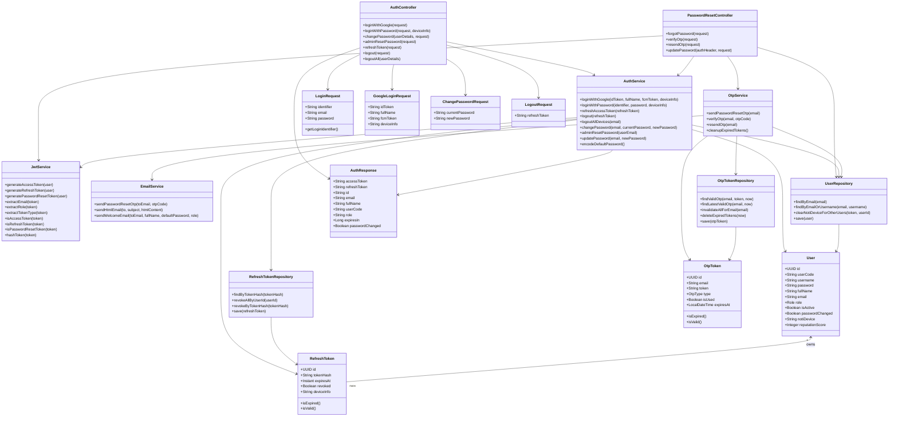

# Authentication Module Class Diagram

```mermaid
classDiagram
    class AuthController {
        +loginWithGoogle(request)
        +loginWithPassword(request, deviceInfo)
        +changePassword(userDetails, request)
        +adminResetPassword(request)
        +refreshToken(request)
        +logout(request)
        +logoutAll(userDetails)
    }

    class PasswordResetController {
        +forgotPassword(request)
        +verifyOtp(request)
        +resendOtp(request)
        +updatePassword(authHeader, request)
    }

    class AuthService {
        +loginWithGoogle(idToken, fullName, fcmToken, deviceInfo)
        +loginWithPassword(identifier, password, deviceInfo)
        +refreshAccessToken(refreshToken)
        +logout(refreshToken)
        +logoutAllDevices(email)
        +changePassword(email, currentPassword, newPassword)
        +adminResetPassword(userEmail)
        +updatePassword(email, newPassword)
        +encodeDefaultPassword()
    }

    class OtpService {
        +sendPasswordResetOtp(email)
        +verifyOtp(email, otpCode)
        +resendOtp(email)
        +cleanupExpiredTokens()
    }

    class JwtService {
        +generateAccessToken(user)
        +generateRefreshToken(user)
        +generatePasswordResetToken(user)
        +extractEmail(token)
        +extractRole(token)
        +extractTokenType(token)
        +isAccessToken(token)
        +isRefreshToken(token)
        +isPasswordResetToken(token)
        +hashToken(token)
    }

    class EmailService {
        +sendPasswordResetOtp(toEmail, otpCode)
        +sendHtmlEmail(to, subject, htmlContent)
        +sendWelcomeEmail(toEmail, fullName, defaultPassword, role)
    }

    class UserRepository {
        +findByEmail(email)
        +findByEmailOrUsername(email, username)
        +clearNotiDeviceForOtherUsers(token, userId)
        +save(user)
    }

    class RefreshTokenRepository {
        +findByTokenHash(tokenHash)
        +revokeAllByUserId(userId)
        +revokeByTokenHash(tokenHash)
        +save(refreshToken)
    }

    class OtpTokenRepository {
        +findValidOtp(email, token, now)
        +findLatestValidOtp(email, now)
        +invalidateAllForEmail(email)
        +deleteExpiredTokens(now)
        +save(otpToken)
    }

    class User {
        +UUID id
        +String userCode
        +String username
        +String password
        +String fullName
        +String email
        +Role role
        +Boolean isActive
        +Boolean passwordChanged
        +String notiDevice
        +Integer reputationScore
    }

    class RefreshToken {
        +UUID id
        +String tokenHash
        +Instant expiresAt
        +Boolean revoked
        +String deviceInfo
        +isExpired()
        +isValid()
    }

    class OtpToken {
        +UUID id
        +String email
        +String token
        +OtpType type
        +Boolean isUsed
        +LocalDateTime expiresAt
        +isExpired()
        +isValid()
    }

    class AuthResponse {
        +String accessToken
        +String refreshToken
        +String id
        +String email
        +String fullName
        +String userCode
        +String role
        +Long expiresIn
        +Boolean passwordChanged
    }

    class LoginRequest {
        +String identifier
        +String email
        +String password
        +getLoginIdentifier()
    }

    class GoogleLoginRequest {
        +String idToken
        +String fullName
        +String fcmToken
        +String deviceInfo
    }

    class ChangePasswordRequest {
        +String currentPassword
        +String newPassword
    }

    class LogoutRequest {
        +String refreshToken
    }

    AuthController --> AuthService
    AuthController --> AuthResponse
    AuthController --> LoginRequest
    AuthController --> GoogleLoginRequest
    AuthController --> ChangePasswordRequest
    AuthController --> LogoutRequest

    PasswordResetController --> OtpService
    PasswordResetController --> AuthService
    PasswordResetController --> UserRepository
    PasswordResetController --> JwtService

    AuthService --> UserRepository
    AuthService --> RefreshTokenRepository
    AuthService --> JwtService
    AuthService --> User
    AuthService --> RefreshToken
    AuthService --> AuthResponse

    OtpService --> OtpTokenRepository
    OtpService --> UserRepository
    OtpService --> EmailService
    OtpService --> OtpToken

    RefreshTokenRepository --> RefreshToken
    OtpTokenRepository --> OtpToken
    UserRepository --> User

    User "1" <-- "many" RefreshToken : owns
```
