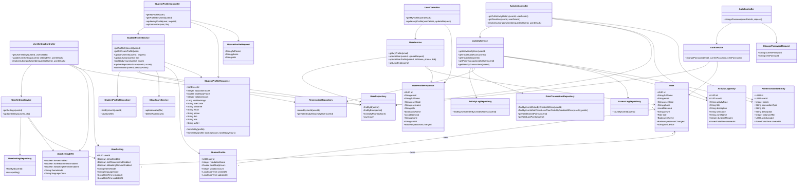

# Account Management Module Class Diagram

```mermaid
classDiagram
    class UserController {
        +getMyProfile(userDetails)
        +updateMyProfile(userDetails, updateRequest)
    }

    class StudentProfileController {
        +getMyProfile(user)
        +getProfileByUserId(userId)
        +updateMyProfile(user, request)
        +uploadAvatar(user, file)
    }

    class UserSettingController {
        +getUserSettings(userId, userDetails)
        +updateUserSettings(userId, settingDTO, userDetails)
        -resolveAuthorizedUserId(requestedUserId, userDetails)
    }

    class ActivityController {
        +getFullActivityHistory(userId, userDetails)
        +getPenalties(userId, userDetails)
        -resolveAuthorizedUserId(requestedUserId, userDetails)
    }

    class AuthController {
        +changePassword(userDetails, request)
    }

    class UserService {
        +getMyProfile(email)
        +updateUser(userId, updateRequest)
        +updateUserProfile(userId, fullName, phone, dob)
        +getUserById(userId)
    }

    class StudentProfileService {
        +getProfileByUserId(userId)
        +getOrCreateProfile(user)
        +updateUserInfo(userId, request)
        +updateAvatar(userId, file)
        +addStudyHours(userId, hours)
        +updateReputationScore(userId, score)
        +addViolation(userId, penaltyPoints)
    }

    class UserSettingService {
        +getSettings(userId)
        +updateSettings(userId, dto)
    }

    class ActivityService {
        +getActivitiesByUser(userId)
        +getTotalStudyHours(userId)
        +getTotalVisits(userId)
        +getPointTransactionsByUser(userId)
        +getPenaltyTransactions(userId)
    }

    class AuthService {
        +changePassword(email, currentPassword, newPassword)
    }

    class CloudinaryService {
        +uploadAvatar(file)
        +deleteAvatars(urls)
    }

    class UserRepository {
        +findById(userId)
        +findByEmail(email)
        +existsByPhone(phone)
        +save(user)
    }

    class StudentProfileRepository {
        +findByUserId(userId)
        +save(profile)
    }

    class UserSettingRepository {
        +findById(userId)
        +save(setting)
    }

    class ReservationRepository {
        +countByUserId(userId)
        +getTotalStudyMinutesByUser(userId)
    }

    class ActivityLogRepository {
        +findByUserIdOrderByCreatedAtDesc(userId)
    }

    class PointTransactionRepository {
        +findByUserIdOrderByCreatedAtDesc(userId)
        +findByUserIdAndPointsLessThanOrderByCreatedAtDesc(userId, points)
        +getTotalEarnedPoints(userId)
        +getTotalLostPoints(userId)
    }

    class AccessLogRepository {
        +countByUserId(userId)
    }

    class User {
        +UUID id
        +String fullName
        +String email
        +String userCode
        +String phone
        +LocalDate dob
        +String avtUrl
        +Role role
        +Boolean isActive
        +Boolean passwordChanged
        +String notiDevice
    }

    class StudentProfile {
        +UUID userId
        +Integer reputationScore
        +Double totalStudyHours
        +Integer violationCount
        +LocalDateTime createdAt
        +LocalDateTime updatedAt
    }

    class UserSetting {
        +UUID userId
        +Boolean isHceEnabled
        +Boolean isAiRecommendEnabled
        +Boolean isBookingRemindEnabled
        +String themeMode
        +String languageCode
        +LocalDateTime createdAt
        +LocalDateTime updatedAt
    }

    class UserProfileResponse {
        +UUID id
        +String email
        +String fullName
        +String userCode
        +String username
        +String role
        +boolean isActive
        +LocalDate dob
        +String phone
        +String avtUrl
        +Boolean passwordChanged
    }

    class StudentProfileResponse {
        +UUID userId
        +Integer reputationScore
        +Double totalStudyHours
        +Integer violationCount
        +Long totalBookings
        +String userCode
        +String fullName
        +String email
        +String phone
        +String dob
        +String role
        +String avtUrl
        +fromEntity(profile)
        +fromEntity(profile, bookingCount, totalStudyHours)
    }

    class UpdateProfileRequest {
        +String fullName
        +String phone
        +String dob
    }

    class UserSettingDTO {
        +Boolean isHceEnabled
        +Boolean isAiRecommendEnabled
        +Boolean isBookingRemindEnabled
        +String themeMode
        +String languageCode
    }

    class ChangePasswordRequest {
        +String currentPassword
        +String newPassword
    }

    class ActivityLogEntity {
        +UUID id
        +UUID userId
        +String activityType
        +String title
        +String description
        +String seatCode
        +String zoneName
        +Integer durationMinutes
        +ZonedDateTime createdAt
    }

    class PointTransactionEntity {
        +UUID id
        +UUID userId
        +Integer points
        +String transactionType
        +String title
        +String description
        +Integer balanceAfter
        +UUID activityLogId
        +ZonedDateTime createdAt
    }

    UserController --> UserService
    UserController --> UserProfileResponse

    StudentProfileController --> StudentProfileService
    StudentProfileController --> StudentProfileResponse
    StudentProfileController --> UpdateProfileRequest

    UserSettingController --> UserSettingService
    UserSettingController --> UserSettingDTO
    UserSettingController --> UserRepository
    UserSettingController --> UserSetting

    ActivityController --> ActivityService
    ActivityController --> UserRepository
    ActivityController --> ActivityLogEntity
    ActivityController --> PointTransactionEntity

    AuthController --> AuthService
    AuthController --> ChangePasswordRequest

    UserService --> UserRepository
    UserService --> User
    UserService --> UserProfileResponse

    StudentProfileService --> StudentProfileRepository
    StudentProfileService --> UserRepository
    StudentProfileService --> ReservationRepository
    StudentProfileService --> CloudinaryService
    StudentProfileService --> StudentProfile
    StudentProfileService --> StudentProfileResponse

    UserSettingService --> UserSettingRepository
    UserSettingService --> UserSetting
    UserSettingService --> UserSettingDTO

    ActivityService --> ActivityLogRepository
    ActivityService --> PointTransactionRepository
    ActivityService --> ReservationRepository
    ActivityService --> AccessLogRepository
    ActivityService --> ActivityLogEntity
    ActivityService --> PointTransactionEntity

    AuthService --> UserRepository
    AuthService --> User

    User "1" <-- "1" StudentProfile : owns
    User "1" <-- "1" UserSetting : owns
```
