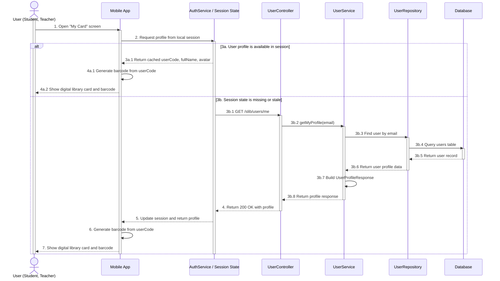

# FE-08 View Barcode

```mermaid
sequenceDiagram
    actor User as User (Student, Teacher)
    participant Client as Mobile App
    participant AuthState as AuthService / Session State
    participant UserController as UserController
    participant UserService as UserService
    participant UserRepo as UserRepository
    participant DB as Database

    activate User
    User->>Client: 1. Open "My Card" screen
    activate Client
    Client->>AuthState: 2. Request profile from local session
    activate AuthState

    alt 3a. User profile is available in session
        AuthState-->>Client: 3a.1 Return cached userCode, fullName, avatar
        Client->>Client: 4a.1 Generate barcode from userCode
        Client-->>User: 4a.2 Show digital library card and barcode
        
    else 3b. Session state is missing or stale
        AuthState->>UserController: 3b.1 GET /slib/users/me
        activate UserController
        UserController->>UserService: 3b.2 getMyProfile(email)
        activate UserService
        UserService->>UserRepo: 3b.3 Find user by email
        activate UserRepo
        UserRepo->>DB: 3b.4 Query users table
        activate DB
        DB-->>UserRepo: 3b.5 Return user record
        deactivate DB
        UserRepo-->>UserService: 3b.6 Return user profile data
        deactivate UserRepo
        
        UserService->>UserService: 3b.7 Build UserProfileResponse
        UserService-->>UserController: 3b.8 Return profile response
        deactivate UserService
        
        UserController-->>AuthState: 4. Return 200 OK with profile
        deactivate UserController
        
        AuthState-->>Client: 5. Update session and return profile
        Client->>Client: 6. Generate barcode from userCode
        Client-->>User: 7. Show digital library card and barcode
    end

    deactivate AuthState
    deactivate Client
    deactivate User
```
