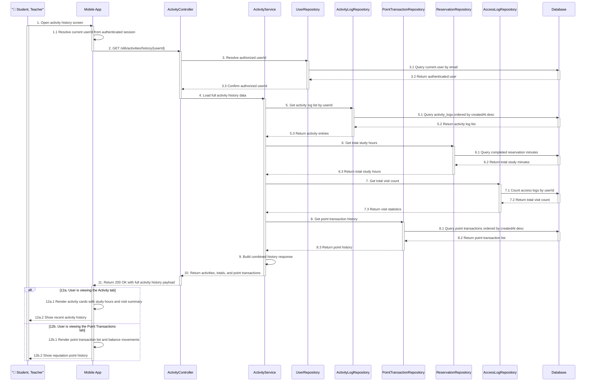

# FE-09 View History of Activities

```mermaid
sequenceDiagram
    participant Users as "👤 Student, Teacher"
    participant Client as Mobile App
    participant ActivityController as ActivityController
    participant ActivityService as ActivityService
    participant UserRepo as UserRepository
    participant ActivityRepo as ActivityLogRepository
    participant PointRepo as PointTransactionRepository
    participant ReservationRepo as ReservationRepository
    participant AccessLogRepo as AccessLogRepository
    participant DB as Database

    Users->>Client: 1. Open activity history screen
    activate Users
    activate Client
    Client->>Client: 1.1 Resolve current userId from authenticated session
    Client->>ActivityController: 2. GET /slib/activities/history/{userId}
    deactivate Client
    activate ActivityController
    ActivityController->>UserRepo: 3. Resolve authorized userId
    activate UserRepo
    UserRepo->>DB: 3.1 Query current user by email
    activate DB
    DB-->>UserRepo: 3.2 Return authenticated user
    deactivate DB
    UserRepo-->>ActivityController: 3.3 Confirm authorized userId
    deactivate UserRepo
    ActivityController->>ActivityService: 4. Load full activity history data
    deactivate ActivityController
    activate ActivityService

    ActivityService->>ActivityRepo: 5. Get activity log list by userId
    activate ActivityRepo
    ActivityRepo->>DB: 5.1 Query activity_logs ordered by createdAt desc
    activate DB
    DB-->>ActivityRepo: 5.2 Return activity log list
    deactivate DB
    ActivityRepo-->>ActivityService: 5.3 Return activity entries
    deactivate ActivityRepo

    ActivityService->>ReservationRepo: 6. Get total study hours
    activate ReservationRepo
    ReservationRepo->>DB: 6.1 Query completed reservation minutes
    activate DB
    DB-->>ReservationRepo: 6.2 Return total study minutes
    deactivate DB
    ReservationRepo-->>ActivityService: 6.3 Return total study hours
    deactivate ReservationRepo

    ActivityService->>AccessLogRepo: 7. Get total visit count
    activate AccessLogRepo
    AccessLogRepo->>DB: 7.1 Count access logs by userId
    activate DB
    DB-->>AccessLogRepo: 7.2 Return total visit count
    deactivate DB
    AccessLogRepo-->>ActivityService: 7.3 Return visit statistics
    deactivate AccessLogRepo

    ActivityService->>PointRepo: 8. Get point transaction history
    activate PointRepo
    PointRepo->>DB: 8.1 Query point transactions ordered by createdAt desc
    activate DB
    DB-->>PointRepo: 8.2 Return point transaction list
    deactivate DB
    PointRepo-->>ActivityService: 8.3 Return point history
    deactivate PointRepo

    ActivityService->>ActivityService: 9. Build combined history response
    ActivityService-->>ActivityController: 10. Return activities, totals, and point transactions
    deactivate ActivityService
    activate ActivityController
    ActivityController-->>Client: 11. Return 200 OK with full activity history payload
    deactivate ActivityController
    activate Client

    alt 12a. User is viewing the Activity tab
        Client->>Client: 12a.1 Render activity cards with study hours and visit summary
        Client-->>Users: 12a.2 Show recent activity history
    else 12b. User is viewing the Point Transactions tab
        Client->>Client: 12b.1 Render point transaction list and balance movements
        Client-->>Users: 12b.2 Show reputation point history
    end

    deactivate Client
    deactivate Users
```
