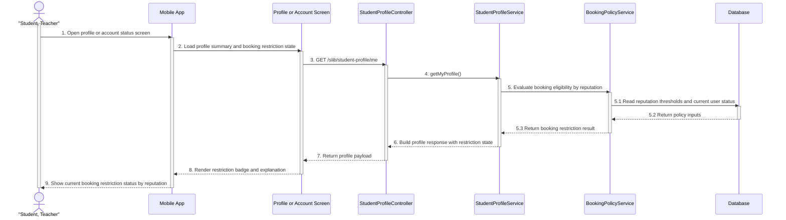

# FE-14 View Booking Restriction Status by Reputation

```mermaid
sequenceDiagram
    actor Users as "Student, Teacher"
    participant Client as Mobile App
    participant ProfileScreen as Profile or Account Screen
    participant ProfileController as StudentProfileController
    participant ProfileService as StudentProfileService
    participant PolicyService as BookingPolicyService
    participant DB as Database

    activate Users
    Users->>Client: 1. Open profile or account status screen
    activate Client
    
    Client->>ProfileScreen: 2. Load profile summary and booking restriction state
    activate ProfileScreen
    
    # Giai đoạn: Gọi API lấy thông tin Profile và Chính sách
    ProfileScreen->>ProfileController: 3. GET /slib/student-profile/me
    activate ProfileController
    
    ProfileController->>ProfileService: 4. getMyProfile()
    activate ProfileService
    
    # Bước 5: Đánh giá điều kiện đặt chỗ dựa trên uy tín
    ProfileService->>PolicyService: 5. Evaluate booking eligibility by reputation
    activate PolicyService
    
    PolicyService->>DB: 5.1 Read reputation thresholds and current user status
    activate DB
    DB-->>PolicyService: 5.2 Return policy inputs
    deactivate DB
    
    PolicyService-->>ProfileService: 5.3 Return booking restriction result
    deactivate PolicyService
    
    # Tổng hợp dữ liệu trả về
    ProfileService-->>ProfileController: 6. Build profile response with restriction state
    deactivate ProfileService
    
    ProfileController-->>ProfileScreen: 7. Return profile payload
    deactivate ProfileController
    
    # Giai đoạn: Hiển thị trên thiết bị di động
    ProfileScreen-->>Client: 8. Render restriction badge and explanation
    deactivate ProfileScreen
    
    Client-->>Users: 9. Show current booking restriction status by reputation
    
    deactivate Client
    deactivate Users
```
