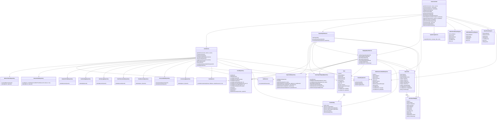

# User Management Module Class Diagram

```mermaid
classDiagram
    class UserController {
        +getAdminUsers(role, status, search)
        +createUser(request, userDetails)
        +importUsers(requests, userDetails)
        +validateUsers(requests)
        +importFromExcel(file)
        +getImportStatus(batchId)
        +getImportErrors(batchId)
        +downloadImportTemplate(response)
        +adminUpdateUser(userId, request, userDetails)
        +toggleUserStatus(userId, request, userDetails)
        +deleteUser(userId, userDetails)
        +getUserActiveBookings(userId)
        +uploadAvatar(file, userCode)
        +uploadAvatarsBatch(files)
        +deleteAvatarsBatch(request)
    }

    class UserService {
        +getAdminUsers(role, isActive, search)
        +createUser(request)
        +importUsers(requests)
        +sendWelcomeEmails(successList)
        +deleteUserById(userId)
        +toggleUserActive(userId, isActive)
        +getUserById(userId)
        +saveUser(user)
        +countActiveOrUpcomingBookings(userId)
        +existsByEmail(email)
    }

    class AsyncImportService {
        +startImport(file)
        +processImportAsync(batchId)
        +enrichAvatarsAsync(batchId, avatarFiles)
    }

    class StagingImportService {
        +validateStagingData(batchId)
        +importValidUsers(batchId)
        +getJobStatus(batchId)
        +getFailedRows(batchId)
        +cleanupStagingData(batchId)
        +completeJob(batchId)
        +failJob(batchId, errorMessage)
    }

    class AuthService {
        +encodeDefaultPassword()
    }

    class EmailService {
        +sendWelcomeEmail(toEmail, fullName, defaultPassword, role)
    }

    class CloudinaryService {
        +uploadAvatar(file)
        +deleteAvatars(urls)
        +deleteImageByUrl(url)
    }

    class SystemLogService {
        +logAudit(module, message, data, actor)
    }

    class UserRepository {
        +findAll(sort)
        +findById(userId)
        +existsByEmail(email)
        +existsByUserCode(userCode)
        +existsByPhone(phone)
        +existsByEmailAndIdNot(email, id)
        +existsByUserCodeAndIdNot(userCode, id)
        +existsByPhoneAndIdNot(phone, id)
        +countByRoleAndIsActiveTrue(role)
        +save(user)
        +saveAll(users)
        +delete(user)
        +updateAvatarUrl(userCode, avatarUrl)
    }

    class ImportJobRepository {
        +findByBatchId(batchId)
        +save(job)
        +updateStatus(batchId, status)
        +updateValidationCounts(batchId, validCount, invalidCount)
        +updateImportedCount(batchId, importedCount)
        +updateAvatarCount(batchId, avatarCount)
        +updateAvatarUploaded(batchId, uploadedCount)
    }

    class UserImportStagingRepository {
        +saveAll(rows)
        +findByBatchIdAndStatus(batchId, status)
        +countByBatchIdAndStatus(batchId, status)
        +deleteByBatchId(batchId)
        +markDuplicateEmails(batchId)
        +markDuplicateUserCodes(batchId)
        +markRemainingAsValid(batchId)
    }

    class RefreshTokenRepository {
        +revokeAllByUserId(userId)
        +deleteByUser_Id(userId)
    }

    class UserSettingRepository {
        +deleteById(userId)
    }

    class StudentProfileRepository {
        +deleteByUserId(userId)
    }

    class ReservationRepository {
        +countByUser_IdAndStatusInAndEndTimeAfter(userId, statuses, now)
        +deleteByUser_Id(userId)
    }

    class ActivityLogRepository {
        +deleteByUserId(userId)
    }

    class PointTransactionRepository {
        +deleteByUserId(userId)
    }

    class ChatSessionRepository {
        +deleteByUser_Id(userId)
    }

    class ConversationRepository {
        +clearLibrarianByUserId(userId)
        +deleteByStudentId(userId)
    }

    class AccessLogRepository {
        +deleteByUser_Id(userId)
    }

    class User {
        +UUID id
        +String fullName
        +String email
        +String userCode
        +String username
        +String phone
        +LocalDate dob
        +Role role
        +Boolean isActive
        +Boolean passwordChanged
        +String avtUrl
        +LocalDateTime createdAt
        +LocalDateTime updatedAt
    }

    class UserSetting {
        +UUID userId
        +Boolean isHceEnabled
        +Boolean isAiRecommendEnabled
        +Boolean isBookingRemindEnabled
        +String themeMode
        +String languageCode
    }

    class ImportJob {
        +UUID batchId
        +String fileName
        +ImportJobStatus status
        +Integer totalRows
        +Integer validCount
        +Integer invalidCount
        +Integer importedCount
        +Integer avatarCount
        +Integer avatarUploaded
        +LocalDateTime createdAt
        +LocalDateTime completedAt
        +String errorMessage
    }

    class UserImportStaging {
        +UUID id
        +UUID batchId
        +Integer rowNumber
        +String userCode
        +String fullName
        +String email
        +String phone
        +LocalDate dob
        +String role
        +String avtUrl
        +StagingStatus status
        +String errorMessage
    }

    class AdminCreateUserRequest {
        +String fullName
        +String email
        +String userCode
        +String phone
        +LocalDate dob
        +Role role
    }

    class AdminUpdateUserRequest {
        +String fullName
        +String email
        +String phone
        +String dob
        +Role role
    }

    class ImportUserRequest {
        +String fullName
        +String userCode
        +String email
        +String phone
        +LocalDate dob
        +Role role
        +String avtUrl
    }

    class AdminUserListItemResponse {
        +UUID id
        +String fullName
        +String email
        +String userCode
        +String role
        +Boolean isActive
        +String avtUrl
        +Boolean passwordChanged
        +String phone
        +LocalDate dob
        +LocalDateTime createdAt
        +LocalDateTime updatedAt
    }

    UserController --> UserService
    UserController --> AsyncImportService
    UserController --> StagingImportService
    UserController --> CloudinaryService
    UserController --> SystemLogService
    UserController --> AdminCreateUserRequest
    UserController --> AdminUpdateUserRequest
    UserController --> ImportUserRequest
    UserController --> AdminUserListItemResponse

    UserService --> UserRepository
    UserService --> RefreshTokenRepository
    UserService --> ReservationRepository
    UserService --> StudentProfileRepository
    UserService --> UserSettingRepository
    UserService --> ActivityLogRepository
    UserService --> PointTransactionRepository
    UserService --> ChatSessionRepository
    UserService --> ConversationRepository
    UserService --> AccessLogRepository
    UserService --> AuthService
    UserService --> CloudinaryService
    UserService --> EmailService
    UserService --> User
    UserService --> UserSetting
    UserService --> AdminUserListItemResponse

    AsyncImportService --> ImportJobRepository
    AsyncImportService --> UserImportStagingRepository
    AsyncImportService --> UserRepository
    AsyncImportService --> StagingImportService
    AsyncImportService --> CloudinaryService
    AsyncImportService --> ImportJob
    AsyncImportService --> UserImportStaging

    StagingImportService --> UserImportStagingRepository
    StagingImportService --> ImportJobRepository
    StagingImportService --> UserRepository
    StagingImportService --> AuthService
    StagingImportService --> User
    StagingImportService --> UserSetting
    StagingImportService --> ImportJob
    StagingImportService --> UserImportStaging

    User "1" --> "1" UserSetting : owns
    ImportJob "1" --> "many" UserImportStaging : tracks
```
