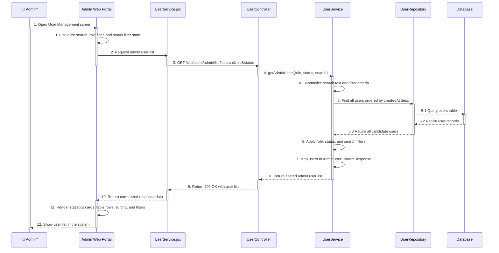

# FE-14 View List of Users in the System

```mermaid
sequenceDiagram
    participant Users as "👤 Admin"
    participant Client as Admin Web Portal
    participant UserApi as UserService.jsx
    participant UserController as UserController
    participant UserService as UserService
    participant UserRepo as UserRepository
    participant DB as Database

    Users->>Client: 1. Open User Management screen
    activate Users
    activate Client
    Client->>Client: 1.1 Initialize search, role filter, and status filter state
    Client->>UserApi: 2. Request admin user list
    activate UserApi
    UserApi->>UserController: 3. GET /slib/users/admin/list?search&role&status
    deactivate UserApi
    deactivate Client
    activate UserController
    UserController->>UserService: 4. getAdminUsers(role, status, search)
    deactivate UserController
    activate UserService
    UserService->>UserService: 4.1 Normalize search text and filter criteria
    UserService->>UserRepo: 5. Find all users ordered by createdAt desc
    activate UserRepo
    UserRepo->>DB: 5.1 Query users table
    activate DB
    DB-->>UserRepo: 5.2 Return user records
    deactivate DB
    UserRepo-->>UserService: 5.3 Return all candidate users
    deactivate UserRepo
    UserService->>UserService: 6. Apply role, status, and search filters
    UserService->>UserService: 7. Map users to AdminUserListItemResponse
    UserService-->>UserController: 8. Return filtered admin user list
    deactivate UserService
    activate UserController
    UserController-->>UserApi: 9. Return 200 OK with user list
    deactivate UserController
    activate UserApi
    UserApi-->>Client: 10. Return normalized response data
    deactivate UserApi
    activate Client
    Client->>Client: 11. Render statistics cards, table rows, sorting, and filters
    Client-->>Users: 12. Show user list in the system
    deactivate Client
    deactivate Users
```
