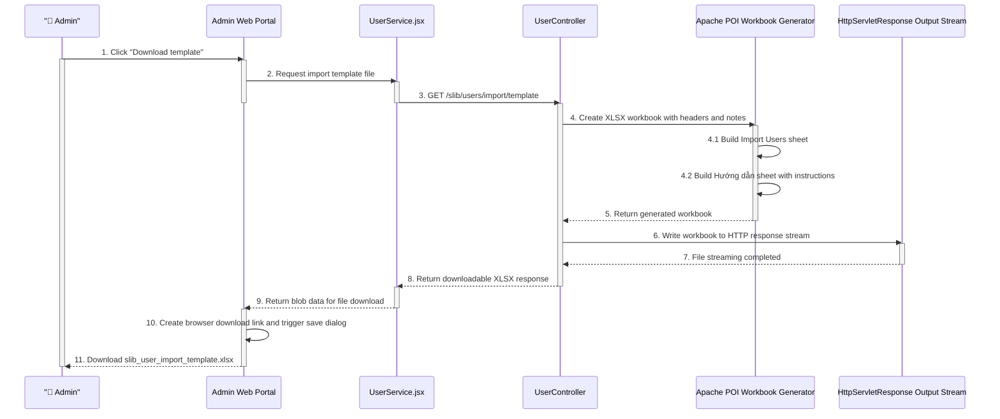

# FE-16 Download Template of the File Upload

```mermaid
sequenceDiagram
    participant Users as "👤 Admin"
    participant Client as Admin Web Portal
    participant UserApi as UserService.jsx
    participant UserController as UserController
    participant WorkbookBuilder as Apache POI Workbook Generator
    participant Stream as HttpServletResponse Output Stream

    Users->>Client: 1. Click "Download template"
    activate Users
    activate Client
    Client->>UserApi: 2. Request import template file
    activate UserApi
    UserApi->>UserController: 3. GET /slib/users/import/template
    deactivate UserApi
    deactivate Client
    activate UserController
    UserController->>WorkbookBuilder: 4. Create XLSX workbook with headers and notes
    activate WorkbookBuilder
    WorkbookBuilder->>WorkbookBuilder: 4.1 Build Import Users sheet
    WorkbookBuilder->>WorkbookBuilder: 4.2 Build Hướng dẫn sheet with instructions
    WorkbookBuilder-->>UserController: 5. Return generated workbook
    deactivate WorkbookBuilder
    UserController->>Stream: 6. Write workbook to HTTP response stream
    activate Stream
    Stream-->>UserController: 7. File streaming completed
    deactivate Stream
    UserController-->>UserApi: 8. Return downloadable XLSX response
    deactivate UserController
    activate UserApi
    UserApi-->>Client: 9. Return blob data for file download
    deactivate UserApi
    activate Client
    Client->>Client: 10. Create browser download link and trigger save dialog
    Client-->>Users: 11. Download slib_user_import_template.xlsx
    deactivate Client
    deactivate Users
```
