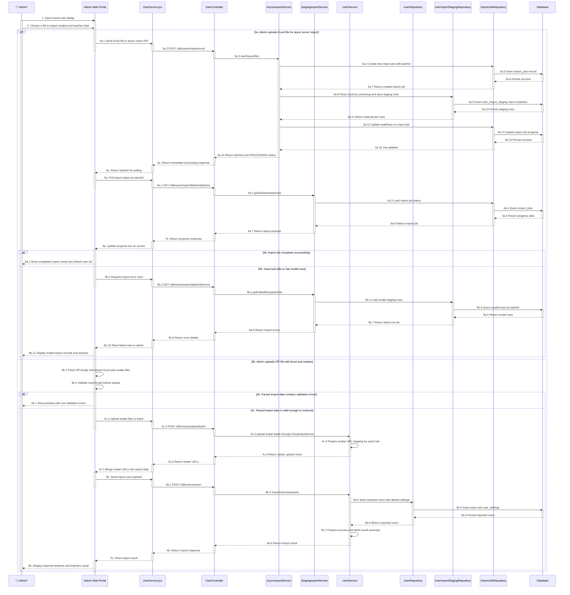

# FE-16 Import Student and Teacher via File

```mermaid
sequenceDiagram
    participant Users as "👤 Admin"
    participant Client as Admin Web Portal
    participant UserApi as UserService.jsx
    participant UserController as UserController
    participant AsyncImportService as AsyncImportService
    participant StagingImportService as StagingImportService
    participant UserService as UserService
    participant UserRepo as UserRepository
    participant StagingRepo as UserImportStagingRepository
    participant JobRepo as ImportJobRepository
    participant DB as Database

    Users->>Client: 1. Open import user dialog
    activate Users
    activate Client
    Users->>Client: 2. Choose a file to import student and teacher data

    alt 3a. Admin uploads Excel file for async server import
        Client->>UserApi: 3a.1 Send Excel file to async import API
        activate UserApi
        UserApi->>UserController: 3a.2 POST /slib/users/import/excel
        deactivate UserApi
        deactivate Client
        activate UserController
        UserController->>AsyncImportService: 3a.3 startImport(file)
        deactivate UserController
        activate AsyncImportService
        AsyncImportService->>JobRepo: 3a.4 Create new import job with batchId
        activate JobRepo
        JobRepo->>DB: 3a.5 Insert import_jobs record
        activate DB
        DB-->>JobRepo: 3a.6 Persist success
        deactivate DB
        JobRepo-->>AsyncImportService: 3a.7 Return created import job
        deactivate JobRepo
        AsyncImportService->>StagingRepo: 3a.8 Parse Excel by streaming and save staging rows
        activate StagingRepo
        StagingRepo->>DB: 3a.9 Insert user_import_staging rows in batches
        activate DB
        DB-->>StagingRepo: 3a.10 Persist staging rows
        deactivate DB
        StagingRepo-->>AsyncImportService: 3a.11 Return total parsed rows
        deactivate StagingRepo
        AsyncImportService->>JobRepo: 3a.12 Update totalRows on import job
        activate JobRepo
        JobRepo->>DB: 3a.13 Update import job progress
        activate DB
        DB-->>JobRepo: 3a.14 Persist success
        deactivate DB
        JobRepo-->>AsyncImportService: 3a.15 Job updated
        deactivate JobRepo
        AsyncImportService-->>UserController: 3a.16 Return batchId and PROCESSING status
        deactivate AsyncImportService
        activate UserController
        UserController-->>UserApi: 4a. Return immediate processing response
        deactivate UserController
        activate UserApi
        UserApi-->>Client: 5a. Return batchId for polling
        deactivate UserApi
        activate Client
        Client->>UserApi: 6a. Poll import status by batchId
        activate UserApi
        UserApi->>UserController: 6a.1 GET /slib/users/import/{batchId}/status
        deactivate UserApi
        deactivate Client
        activate UserController
        UserController->>StagingImportService: 6a.2 getJobStatus(batchId)
        deactivate UserController
        activate StagingImportService
        StagingImportService->>JobRepo: 6a.3 Load import job status
        activate JobRepo
        JobRepo->>DB: 6a.4 Query import_jobs
        activate DB
        DB-->>JobRepo: 6a.5 Return progress data
        deactivate DB
        JobRepo-->>StagingImportService: 6a.6 Return import job
        deactivate JobRepo
        StagingImportService-->>UserController: 6a.7 Return status payload
        deactivate StagingImportService
        activate UserController
        UserController-->>UserApi: 7a. Return progress response
        deactivate UserController
        activate UserApi
        UserApi-->>Client: 8a. Update progress bar on screen
        deactivate UserApi
        activate Client

        alt 9a. Import job completes successfully
            Client-->>Users: 9a.1 Show completed import result and refresh user list
        else 9b. Import job fails or has invalid rows
            Client->>UserApi: 9b.1 Request import error rows
            activate UserApi
            UserApi->>UserController: 9b.2 GET /slib/users/import/{batchId}/errors
            deactivate UserApi
            deactivate Client
            activate UserController
            UserController->>StagingImportService: 9b.3 getFailedRows(batchId)
            deactivate UserController
            activate StagingImportService
            StagingImportService->>StagingRepo: 9b.4 Load invalid staging rows
            activate StagingRepo
            StagingRepo->>DB: 9b.5 Query invalid rows by batchId
            activate DB
            DB-->>StagingRepo: 9b.6 Return invalid rows
            deactivate DB
            StagingRepo-->>StagingImportService: 9b.7 Return failed row list
            deactivate StagingRepo
            StagingImportService-->>UserController: 9b.8 Return import errors
            deactivate StagingImportService
            activate UserController
            UserController-->>UserApi: 9b.9 Return error details
            deactivate UserController
            activate UserApi
            UserApi-->>Client: 9b.10 Show failed rows to admin
            deactivate UserApi
            activate Client
            Client-->>Users: 9b.11 Display invalid import records and reasons
        end
    else 3b. Admin uploads ZIP file with Excel and avatars
        Client->>Client: 3b.1 Parse ZIP locally and extract Excel plus avatar files
        Client->>Client: 3b.2 Validate rows locally before upload

        alt 4b. Parsed import data contains validation errors
            Client-->>Users: 4b.1 Show preview with row validation errors
        else 4c. Parsed import data is valid enough to continue
            Client->>UserApi: 4c.1 Upload avatar files in batch
            activate UserApi
            UserApi->>UserController: 4c.2 POST /slib/users/avatars/batch
            deactivate UserApi
            deactivate Client
            activate UserController
            UserController->>UserService: 4c.3 upload avatar batch through CloudinaryService
            deactivate UserController
            activate UserService
            UserService->>UserService: 4c.4 Prepare avatar URL mapping by userCode
            UserService-->>UserController: 4c.5 Return avatar upload result
            deactivate UserService
            activate UserController
            UserController-->>UserApi: 4c.6 Return avatar URLs
            deactivate UserController
            activate UserApi
            UserApi-->>Client: 4c.7 Merge avatar URLs into import data
            deactivate UserApi
            activate Client
            Client->>UserApi: 5b. Send import user payload
            activate UserApi
            UserApi->>UserController: 5b.1 POST /slib/users/import
            deactivate UserApi
            deactivate Client
            activate UserController
            UserController->>UserService: 5b.2 importUsers(requests)
            deactivate UserController
            activate UserService
            UserService->>UserRepo: 5b.3 Save imported users with default settings
            activate UserRepo
            UserRepo->>DB: 5b.4 Insert users and user_settings
            activate DB
            DB-->>UserRepo: 5b.5 Persist imported users
            deactivate DB
            UserRepo-->>UserService: 5b.6 Return imported users
            deactivate UserRepo
            UserService->>UserService: 5b.7 Prepare success and failed result summary
            UserService-->>UserController: 5b.8 Return import result
            deactivate UserService
            activate UserController
            UserController-->>UserApi: 6b. Return import response
            deactivate UserController
            activate UserApi
            UserApi-->>Client: 7b. Show import result
            deactivate UserApi
            activate Client
            Client-->>Users: 8b. Display imported students and teachers result
        end
    end

    deactivate Client
    deactivate Users
```

