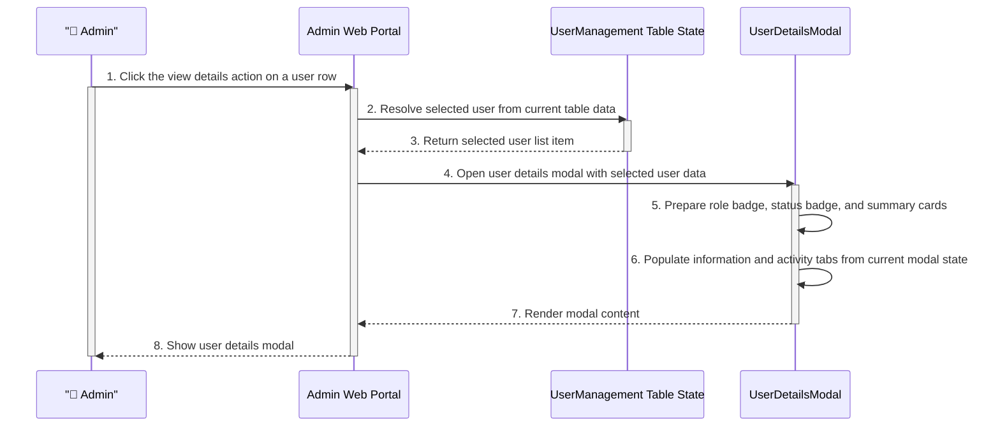

# FE-19 View User Details

```mermaid
sequenceDiagram
    participant Users as "👤 Admin"
    participant Client as Admin Web Portal
    participant UserTable as UserManagement Table State
    participant DetailsModal as UserDetailsModal

    Users->>Client: 1. Click the view details action on a user row
    activate Users
    activate Client
    Client->>UserTable: 2. Resolve selected user from current table data
    activate UserTable
    UserTable-->>Client: 3. Return selected user list item
    deactivate UserTable
    Client->>DetailsModal: 4. Open user details modal with selected user data
    activate DetailsModal
    DetailsModal->>DetailsModal: 5. Prepare role badge, status badge, and summary cards
    DetailsModal->>DetailsModal: 6. Populate information and activity tabs from current modal state
    DetailsModal-->>Client: 7. Render modal content
    deactivate DetailsModal
    Client-->>Users: 8. Show user details modal
    deactivate Client
    deactivate Users
```

