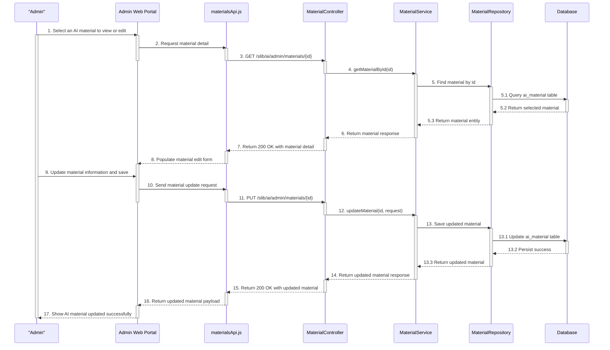

# FE-43a View and Update Material

```mermaid
sequenceDiagram
    participant Users as "Admin"
    participant Client as Admin Web Portal
    participant MaterialApi as materialsApi.js
    participant MaterialController as MaterialController
    participant MaterialService as MaterialService
    participant MaterialRepo as MaterialRepository
    participant DB as Database

    Users->>Client: 1. Select an AI material to view or edit
    activate Users
    activate Client
    Client->>MaterialApi: 2. Request material detail
    activate MaterialApi
    MaterialApi->>MaterialController: 3. GET /slib/ai/admin/materials/{id}
    deactivate MaterialApi
    deactivate Client
    activate MaterialController
    MaterialController->>MaterialService: 4. getMaterialById(id)
    deactivate MaterialController
    activate MaterialService
    MaterialService->>MaterialRepo: 5. Find material by id
    activate MaterialRepo
    MaterialRepo->>DB: 5.1 Query ai_material table
    activate DB
    DB-->>MaterialRepo: 5.2 Return selected material
    deactivate DB
    MaterialRepo-->>MaterialService: 5.3 Return material entity
    deactivate MaterialRepo
    MaterialService-->>MaterialController: 6. Return material response
    deactivate MaterialService
    activate MaterialController
    MaterialController-->>MaterialApi: 7. Return 200 OK with material detail
    deactivate MaterialController
    activate MaterialApi
    MaterialApi-->>Client: 8. Populate material edit form
    deactivate MaterialApi
    activate Client
    Users->>Client: 9. Update material information and save
    Client->>MaterialApi: 10. Send material update request
    activate MaterialApi
    MaterialApi->>MaterialController: 11. PUT /slib/ai/admin/materials/{id}
    deactivate MaterialApi
    deactivate Client
    activate MaterialController
    MaterialController->>MaterialService: 12. updateMaterial(id, request)
    deactivate MaterialController
    activate MaterialService
    MaterialService->>MaterialRepo: 13. Save updated material
    activate MaterialRepo
    MaterialRepo->>DB: 13.1 Update ai_material table
    activate DB
    DB-->>MaterialRepo: 13.2 Persist success
    deactivate DB
    MaterialRepo-->>MaterialService: 13.3 Return updated material
    deactivate MaterialRepo
    MaterialService-->>MaterialController: 14. Return updated material response
    deactivate MaterialService
    activate MaterialController
    MaterialController-->>MaterialApi: 15. Return 200 OK with updated material
    deactivate MaterialController
    activate MaterialApi
    MaterialApi-->>Client: 16. Return updated material payload
    deactivate MaterialApi
    activate Client
    Client-->>Users: 17. Show AI material updated successfully
    deactivate Client
    deactivate Users
```
