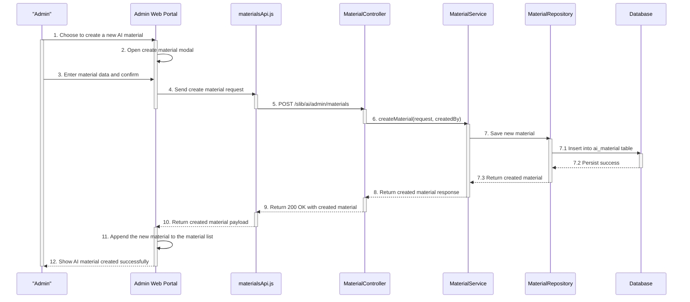

# FE-43b Create Material

```mermaid
sequenceDiagram
    participant Users as "Admin"
    participant Client as Admin Web Portal
    participant MaterialApi as materialsApi.js
    participant MaterialController as MaterialController
    participant MaterialService as MaterialService
    participant MaterialRepo as MaterialRepository
    participant DB as Database

    Users->>Client: 1. Choose to create a new AI material
    activate Users
    activate Client
    Client->>Client: 2. Open create material modal
    Users->>Client: 3. Enter material data and confirm
    Client->>MaterialApi: 4. Send create material request
    activate MaterialApi
    MaterialApi->>MaterialController: 5. POST /slib/ai/admin/materials
    deactivate MaterialApi
    deactivate Client
    activate MaterialController
    MaterialController->>MaterialService: 6. createMaterial(request, createdBy)
    deactivate MaterialController
    activate MaterialService
    MaterialService->>MaterialRepo: 7. Save new material
    activate MaterialRepo
    MaterialRepo->>DB: 7.1 Insert into ai_material table
    activate DB
    DB-->>MaterialRepo: 7.2 Persist success
    deactivate DB
    MaterialRepo-->>MaterialService: 7.3 Return created material
    deactivate MaterialRepo
    MaterialService-->>MaterialController: 8. Return created material response
    deactivate MaterialService
    activate MaterialController
    MaterialController-->>MaterialApi: 9. Return 200 OK with created material
    deactivate MaterialController
    activate MaterialApi
    MaterialApi-->>Client: 10. Return created material payload
    deactivate MaterialApi
    activate Client
    Client->>Client: 11. Append the new material to the material list
    Client-->>Users: 12. Show AI material created successfully
    deactivate Client
    deactivate Users
```
