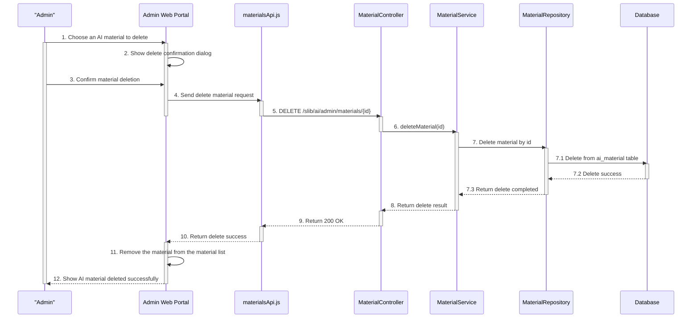

# FE-43c Delete Material

```mermaid
sequenceDiagram
    participant Users as "Admin"
    participant Client as Admin Web Portal
    participant MaterialApi as materialsApi.js
    participant MaterialController as MaterialController
    participant MaterialService as MaterialService
    participant MaterialRepo as MaterialRepository
    participant DB as Database

    Users->>Client: 1. Choose an AI material to delete
    activate Users
    activate Client
    Client->>Client: 2. Show delete confirmation dialog
    Users->>Client: 3. Confirm material deletion
    Client->>MaterialApi: 4. Send delete material request
    activate MaterialApi
    MaterialApi->>MaterialController: 5. DELETE /slib/ai/admin/materials/{id}
    deactivate MaterialApi
    deactivate Client
    activate MaterialController
    MaterialController->>MaterialService: 6. deleteMaterial(id)
    deactivate MaterialController
    activate MaterialService
    MaterialService->>MaterialRepo: 7. Delete material by id
    activate MaterialRepo
    MaterialRepo->>DB: 7.1 Delete from ai_material table
    activate DB
    DB-->>MaterialRepo: 7.2 Delete success
    deactivate DB
    MaterialRepo-->>MaterialService: 7.3 Return delete completed
    deactivate MaterialRepo
    MaterialService-->>MaterialController: 8. Return delete result
    deactivate MaterialService
    activate MaterialController
    MaterialController-->>MaterialApi: 9. Return 200 OK
    deactivate MaterialController
    activate MaterialApi
    MaterialApi-->>Client: 10. Return delete success
    deactivate MaterialApi
    activate Client
    Client->>Client: 11. Remove the material from the material list
    Client-->>Users: 12. Show AI material deleted successfully
    deactivate Client
    deactivate Users
```
