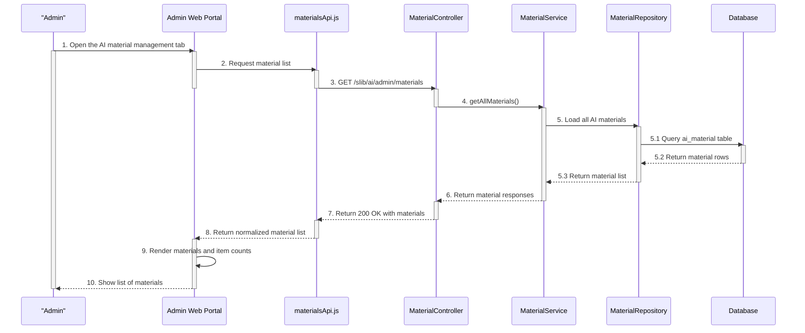

# FE-44 View List of Materials

```mermaid
sequenceDiagram
    participant Users as "Admin"
    participant Client as Admin Web Portal
    participant MaterialApi as materialsApi.js
    participant MaterialController as MaterialController
    participant MaterialService as MaterialService
    participant MaterialRepo as MaterialRepository
    participant DB as Database

    Users->>Client: 1. Open the AI material management tab
    activate Users
    activate Client
    Client->>MaterialApi: 2. Request material list
    activate MaterialApi
    MaterialApi->>MaterialController: 3. GET /slib/ai/admin/materials
    deactivate MaterialApi
    deactivate Client
    activate MaterialController
    MaterialController->>MaterialService: 4. getAllMaterials()
    deactivate MaterialController
    activate MaterialService
    MaterialService->>MaterialRepo: 5. Load all AI materials
    activate MaterialRepo
    MaterialRepo->>DB: 5.1 Query ai_material table
    activate DB
    DB-->>MaterialRepo: 5.2 Return material rows
    deactivate DB
    MaterialRepo-->>MaterialService: 5.3 Return material list
    deactivate MaterialRepo
    MaterialService-->>MaterialController: 6. Return material responses
    deactivate MaterialService
    activate MaterialController
    MaterialController-->>MaterialApi: 7. Return 200 OK with materials
    deactivate MaterialController
    activate MaterialApi
    MaterialApi-->>Client: 8. Return normalized material list
    deactivate MaterialApi
    activate Client
    Client->>Client: 9. Render materials and item counts
    Client-->>Users: 10. Show list of materials
    deactivate Client
    deactivate Users
```
