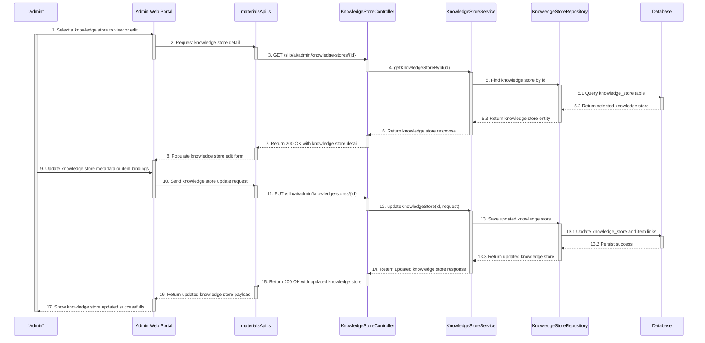

# FE-45a View and Update Knowledge Store

```mermaid
sequenceDiagram
    participant Users as "Admin"
    participant Client as Admin Web Portal
    participant MaterialApi as materialsApi.js
    participant KsController as KnowledgeStoreController
    participant KsService as KnowledgeStoreService
    participant KsRepo as KnowledgeStoreRepository
    participant DB as Database

    Users->>Client: 1. Select a knowledge store to view or edit
    activate Users
    activate Client
    Client->>MaterialApi: 2. Request knowledge store detail
    activate MaterialApi
    MaterialApi->>KsController: 3. GET /slib/ai/admin/knowledge-stores/{id}
    deactivate MaterialApi
    deactivate Client
    activate KsController
    KsController->>KsService: 4. getKnowledgeStoreById(id)
    deactivate KsController
    activate KsService
    KsService->>KsRepo: 5. Find knowledge store by id
    activate KsRepo
    KsRepo->>DB: 5.1 Query knowledge_store table
    activate DB
    DB-->>KsRepo: 5.2 Return selected knowledge store
    deactivate DB
    KsRepo-->>KsService: 5.3 Return knowledge store entity
    deactivate KsRepo
    KsService-->>KsController: 6. Return knowledge store response
    deactivate KsService
    activate KsController
    KsController-->>MaterialApi: 7. Return 200 OK with knowledge store detail
    deactivate KsController
    activate MaterialApi
    MaterialApi-->>Client: 8. Populate knowledge store edit form
    deactivate MaterialApi
    activate Client
    Users->>Client: 9. Update knowledge store metadata or item bindings
    Client->>MaterialApi: 10. Send knowledge store update request
    activate MaterialApi
    MaterialApi->>KsController: 11. PUT /slib/ai/admin/knowledge-stores/{id}
    deactivate MaterialApi
    deactivate Client
    activate KsController
    KsController->>KsService: 12. updateKnowledgeStore(id, request)
    deactivate KsController
    activate KsService
    KsService->>KsRepo: 13. Save updated knowledge store
    activate KsRepo
    KsRepo->>DB: 13.1 Update knowledge_store and item links
    activate DB
    DB-->>KsRepo: 13.2 Persist success
    deactivate DB
    KsRepo-->>KsService: 13.3 Return updated knowledge store
    deactivate KsRepo
    KsService-->>KsController: 14. Return updated knowledge store response
    deactivate KsService
    activate KsController
    KsController-->>MaterialApi: 15. Return 200 OK with updated knowledge store
    deactivate KsController
    activate MaterialApi
    MaterialApi-->>Client: 16. Return updated knowledge store payload
    deactivate MaterialApi
    activate Client
    Client-->>Users: 17. Show knowledge store updated successfully
    deactivate Client
    deactivate Users
```
