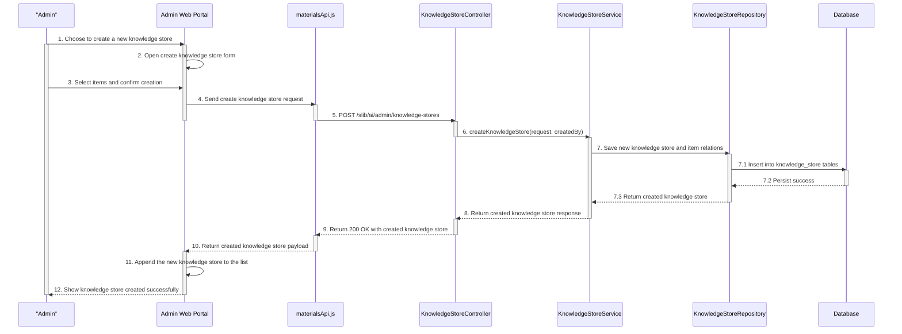

# FE-45b Create Knowledge Store

```mermaid
sequenceDiagram
    participant Users as "Admin"
    participant Client as Admin Web Portal
    participant MaterialApi as materialsApi.js
    participant KsController as KnowledgeStoreController
    participant KsService as KnowledgeStoreService
    participant KsRepo as KnowledgeStoreRepository
    participant DB as Database

    Users->>Client: 1. Choose to create a new knowledge store
    activate Users
    activate Client
    Client->>Client: 2. Open create knowledge store form
    Users->>Client: 3. Select items and confirm creation
    Client->>MaterialApi: 4. Send create knowledge store request
    activate MaterialApi
    MaterialApi->>KsController: 5. POST /slib/ai/admin/knowledge-stores
    deactivate MaterialApi
    deactivate Client
    activate KsController
    KsController->>KsService: 6. createKnowledgeStore(request, createdBy)
    deactivate KsController
    activate KsService
    KsService->>KsRepo: 7. Save new knowledge store and item relations
    activate KsRepo
    KsRepo->>DB: 7.1 Insert into knowledge_store tables
    activate DB
    DB-->>KsRepo: 7.2 Persist success
    deactivate DB
    KsRepo-->>KsService: 7.3 Return created knowledge store
    deactivate KsRepo
    KsService-->>KsController: 8. Return created knowledge store response
    deactivate KsService
    activate KsController
    KsController-->>MaterialApi: 9. Return 200 OK with created knowledge store
    deactivate KsController
    activate MaterialApi
    MaterialApi-->>Client: 10. Return created knowledge store payload
    deactivate MaterialApi
    activate Client
    Client->>Client: 11. Append the new knowledge store to the list
    Client-->>Users: 12. Show knowledge store created successfully
    deactivate Client
    deactivate Users
```
