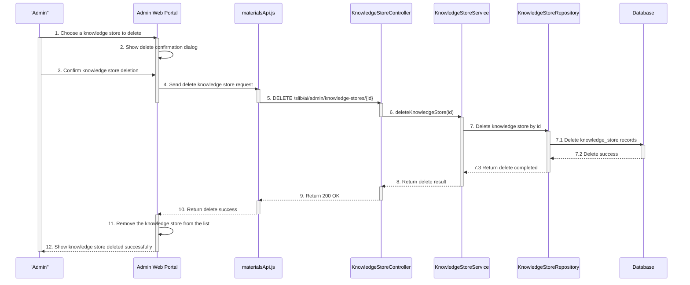

# FE-45c Delete Knowledge Store

```mermaid
sequenceDiagram
    participant Users as "Admin"
    participant Client as Admin Web Portal
    participant MaterialApi as materialsApi.js
    participant KsController as KnowledgeStoreController
    participant KsService as KnowledgeStoreService
    participant KsRepo as KnowledgeStoreRepository
    participant DB as Database

    Users->>Client: 1. Choose a knowledge store to delete
    activate Users
    activate Client
    Client->>Client: 2. Show delete confirmation dialog
    Users->>Client: 3. Confirm knowledge store deletion
    Client->>MaterialApi: 4. Send delete knowledge store request
    activate MaterialApi
    MaterialApi->>KsController: 5. DELETE /slib/ai/admin/knowledge-stores/{id}
    deactivate MaterialApi
    deactivate Client
    activate KsController
    KsController->>KsService: 6. deleteKnowledgeStore(id)
    deactivate KsController
    activate KsService
    KsService->>KsRepo: 7. Delete knowledge store by id
    activate KsRepo
    KsRepo->>DB: 7.1 Delete knowledge_store records
    activate DB
    DB-->>KsRepo: 7.2 Delete success
    deactivate DB
    KsRepo-->>KsService: 7.3 Return delete completed
    deactivate KsRepo
    KsService-->>KsController: 8. Return delete result
    deactivate KsService
    activate KsController
    KsController-->>MaterialApi: 9. Return 200 OK
    deactivate KsController
    activate MaterialApi
    MaterialApi-->>Client: 10. Return delete success
    deactivate MaterialApi
    activate Client
    Client->>Client: 11. Remove the knowledge store from the list
    Client-->>Users: 12. Show knowledge store deleted successfully
    deactivate Client
    deactivate Users
```
