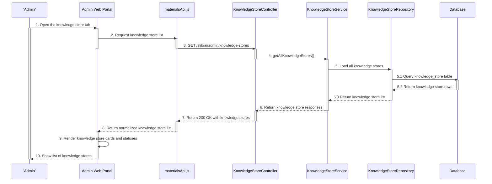

# FE-46 View List of Knowledge Stores

```mermaid
sequenceDiagram
    participant Users as "Admin"
    participant Client as Admin Web Portal
    participant MaterialApi as materialsApi.js
    participant KsController as KnowledgeStoreController
    participant KsService as KnowledgeStoreService
    participant KsRepo as KnowledgeStoreRepository
    participant DB as Database

    Users->>Client: 1. Open the knowledge store tab
    activate Users
    activate Client
    Client->>MaterialApi: 2. Request knowledge store list
    activate MaterialApi
    MaterialApi->>KsController: 3. GET /slib/ai/admin/knowledge-stores
    deactivate MaterialApi
    deactivate Client
    activate KsController
    KsController->>KsService: 4. getAllKnowledgeStores()
    deactivate KsController
    activate KsService
    KsService->>KsRepo: 5. Load all knowledge stores
    activate KsRepo
    KsRepo->>DB: 5.1 Query knowledge_store table
    activate DB
    DB-->>KsRepo: 5.2 Return knowledge store rows
    deactivate DB
    KsRepo-->>KsService: 5.3 Return knowledge store list
    deactivate KsRepo
    KsService-->>KsController: 6. Return knowledge store responses
    deactivate KsService
    activate KsController
    KsController-->>MaterialApi: 7. Return 200 OK with knowledge stores
    deactivate KsController
    activate MaterialApi
    MaterialApi-->>Client: 8. Return normalized knowledge store list
    deactivate MaterialApi
    activate Client
    Client->>Client: 9. Render knowledge store cards and statuses
    Client-->>Users: 10. Show list of knowledge stores
    deactivate Client
    deactivate Users
```
