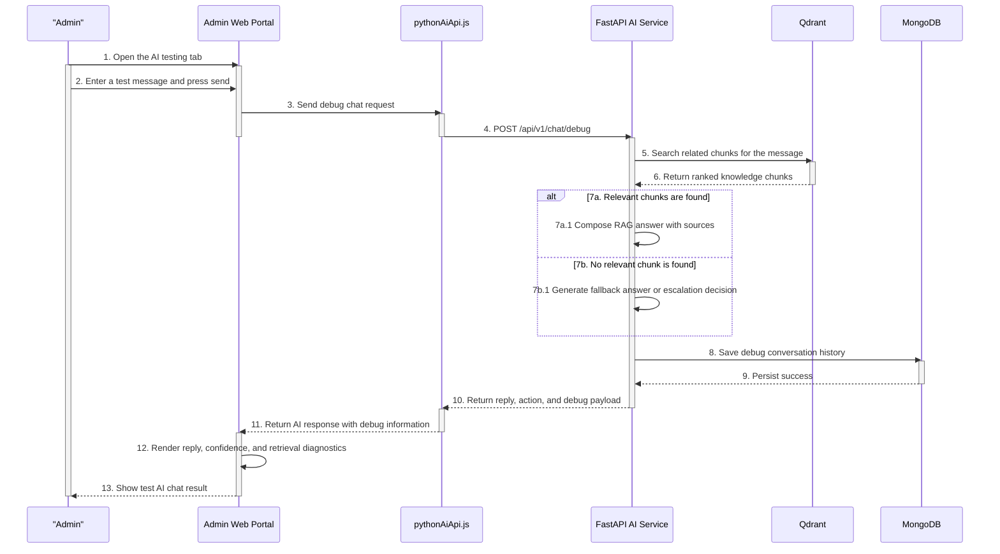

# FE-47 Test AI Chat

```mermaid
sequenceDiagram
    participant Users as "Admin"
    participant Client as Admin Web Portal
    participant AiApi as pythonAiApi.js
    participant AiService as FastAPI AI Service
    participant VectorStore as Qdrant
    participant ChatStore as MongoDB

    Users->>Client: 1. Open the AI testing tab
    activate Users
    activate Client
    Users->>Client: 2. Enter a test message and press send
    Client->>AiApi: 3. Send debug chat request
    activate AiApi
    AiApi->>AiService: 4. POST /api/v1/chat/debug
    deactivate AiApi
    deactivate Client
    activate AiService
    AiService->>VectorStore: 5. Search related chunks for the message
    activate VectorStore
    VectorStore-->>AiService: 6. Return ranked knowledge chunks
    deactivate VectorStore

    alt 7a. Relevant chunks are found
        AiService->>AiService: 7a.1 Compose RAG answer with sources
    else 7b. No relevant chunk is found
        AiService->>AiService: 7b.1 Generate fallback answer or escalation decision
    end

    AiService->>ChatStore: 8. Save debug conversation history
    activate ChatStore
    ChatStore-->>AiService: 9. Persist success
    deactivate ChatStore
    AiService-->>AiApi: 10. Return reply, action, and debug payload
    deactivate AiService
    activate AiApi
    AiApi-->>Client: 11. Return AI response with debug information
    deactivate AiApi
    activate Client
    Client->>Client: 12. Render reply, confidence, and retrieval diagnostics
    Client-->>Users: 13. Show test AI chat result
    deactivate Client
    deactivate Users
```
