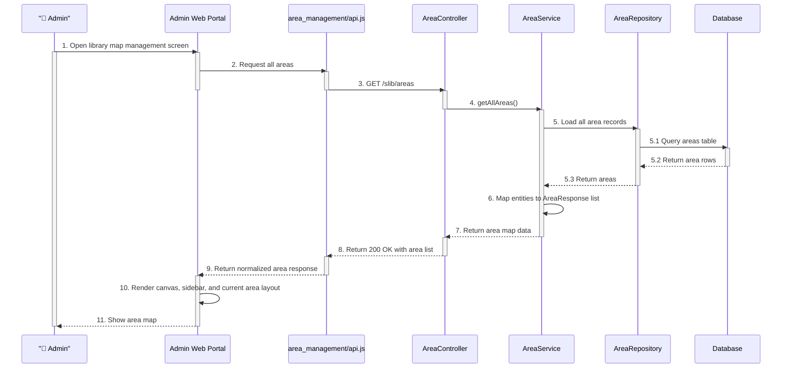

# FE-21 View Area Map

```mermaid
sequenceDiagram
    participant Users as "👤 Admin"
    participant Client as Admin Web Portal
    participant AreaApi as area_management/api.js
    participant AreaController as AreaController
    participant AreaService as AreaService
    participant AreaRepo as AreaRepository
    participant DB as Database

    Users->>Client: 1. Open library map management screen
    activate Users
    activate Client
    Client->>AreaApi: 2. Request all areas
    activate AreaApi
    AreaApi->>AreaController: 3. GET /slib/areas
    deactivate AreaApi
    deactivate Client
    activate AreaController
    AreaController->>AreaService: 4. getAllAreas()
    deactivate AreaController
    activate AreaService
    AreaService->>AreaRepo: 5. Load all area records
    activate AreaRepo
    AreaRepo->>DB: 5.1 Query areas table
    activate DB
    DB-->>AreaRepo: 5.2 Return area rows
    deactivate DB
    AreaRepo-->>AreaService: 5.3 Return areas
    deactivate AreaRepo
    AreaService->>AreaService: 6. Map entities to AreaResponse list
    AreaService-->>AreaController: 7. Return area map data
    deactivate AreaService
    activate AreaController
    AreaController-->>AreaApi: 8. Return 200 OK with area list
    deactivate AreaController
    activate AreaApi
    AreaApi-->>Client: 9. Return normalized area response
    deactivate AreaApi
    activate Client
    Client->>Client: 10. Render canvas, sidebar, and current area layout
    Client-->>Users: 11. Show area map
    deactivate Client
    deactivate Users
```
