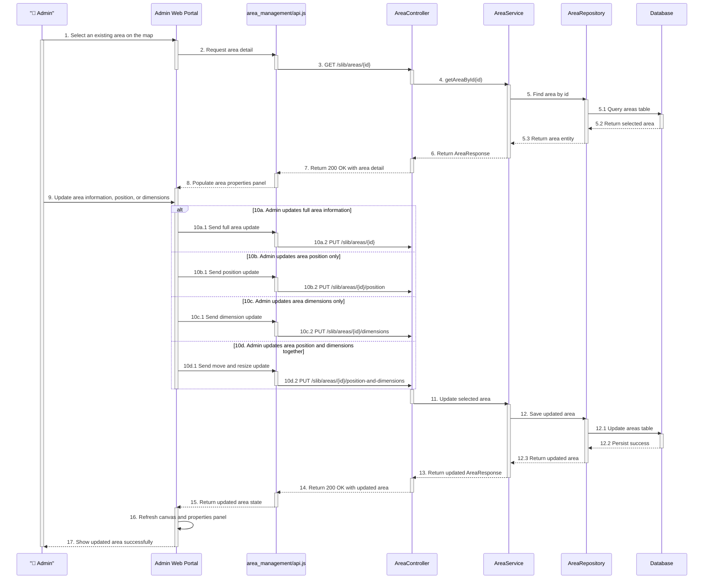

# FE-22a View and Update Area

```mermaid
sequenceDiagram
    participant Users as "👤 Admin"
    participant Client as Admin Web Portal
    participant AreaApi as area_management/api.js
    participant AreaController as AreaController
    participant AreaService as AreaService
    participant AreaRepo as AreaRepository
    participant DB as Database

    Users->>Client: 1. Select an existing area on the map
    activate Users
    activate Client
    Client->>AreaApi: 2. Request area detail
    activate AreaApi
    AreaApi->>AreaController: 3. GET /slib/areas/{id}
    deactivate AreaApi
    deactivate Client
    activate AreaController
    AreaController->>AreaService: 4. getAreaById(id)
    deactivate AreaController
    activate AreaService
    AreaService->>AreaRepo: 5. Find area by id
    activate AreaRepo
    AreaRepo->>DB: 5.1 Query areas table
    activate DB
    DB-->>AreaRepo: 5.2 Return selected area
    deactivate DB
    AreaRepo-->>AreaService: 5.3 Return area entity
    deactivate AreaRepo
    AreaService-->>AreaController: 6. Return AreaResponse
    deactivate AreaService
    activate AreaController
    AreaController-->>AreaApi: 7. Return 200 OK with area detail
    deactivate AreaController
    activate AreaApi
    AreaApi-->>Client: 8. Populate area properties panel
    deactivate AreaApi
    activate Client
    Users->>Client: 9. Update area information, position, or dimensions

    alt 10a. Admin updates full area information
        Client->>AreaApi: 10a.1 Send full area update
        activate AreaApi
        AreaApi->>AreaController: 10a.2 PUT /slib/areas/{id}
        deactivate AreaApi
    else 10b. Admin updates area position only
        Client->>AreaApi: 10b.1 Send position update
        activate AreaApi
        AreaApi->>AreaController: 10b.2 PUT /slib/areas/{id}/position
        deactivate AreaApi
    else 10c. Admin updates area dimensions only
        Client->>AreaApi: 10c.1 Send dimension update
        activate AreaApi
        AreaApi->>AreaController: 10c.2 PUT /slib/areas/{id}/dimensions
        deactivate AreaApi
    else 10d. Admin updates area position and dimensions together
        Client->>AreaApi: 10d.1 Send move and resize update
        activate AreaApi
        AreaApi->>AreaController: 10d.2 PUT /slib/areas/{id}/position-and-dimensions
        deactivate AreaApi
    end

    deactivate Client
    activate AreaController
    AreaController->>AreaService: 11. Update selected area
    deactivate AreaController
    activate AreaService
    AreaService->>AreaRepo: 12. Save updated area
    activate AreaRepo
    AreaRepo->>DB: 12.1 Update areas table
    activate DB
    DB-->>AreaRepo: 12.2 Persist success
    deactivate DB
    AreaRepo-->>AreaService: 12.3 Return updated area
    deactivate AreaRepo
    AreaService-->>AreaController: 13. Return updated AreaResponse
    deactivate AreaService
    activate AreaController
    AreaController-->>AreaApi: 14. Return 200 OK with updated area
    deactivate AreaController
    activate AreaApi
    AreaApi-->>Client: 15. Return updated area state
    deactivate AreaApi
    activate Client
    Client->>Client: 16. Refresh canvas and properties panel
    Client-->>Users: 17. Show updated area successfully
    deactivate Client
    deactivate Users
```
