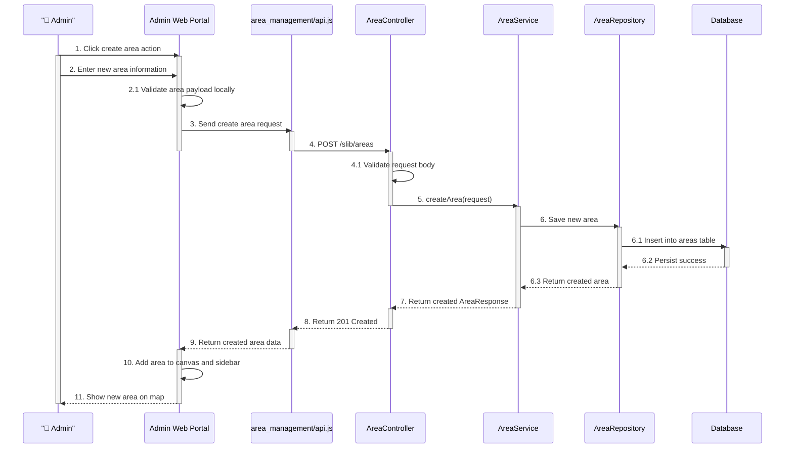

# FE-22b Create Area

```mermaid
sequenceDiagram
    participant Users as "👤 Admin"
    participant Client as Admin Web Portal
    participant AreaApi as area_management/api.js
    participant AreaController as AreaController
    participant AreaService as AreaService
    participant AreaRepo as AreaRepository
    participant DB as Database

    Users->>Client: 1. Click create area action
    activate Users
    activate Client
    Users->>Client: 2. Enter new area information
    Client->>Client: 2.1 Validate area payload locally
    Client->>AreaApi: 3. Send create area request
    activate AreaApi
    AreaApi->>AreaController: 4. POST /slib/areas
    deactivate AreaApi
    deactivate Client
    activate AreaController
    AreaController->>AreaController: 4.1 Validate request body
    AreaController->>AreaService: 5. createArea(request)
    deactivate AreaController
    activate AreaService
    AreaService->>AreaRepo: 6. Save new area
    activate AreaRepo
    AreaRepo->>DB: 6.1 Insert into areas table
    activate DB
    DB-->>AreaRepo: 6.2 Persist success
    deactivate DB
    AreaRepo-->>AreaService: 6.3 Return created area
    deactivate AreaRepo
    AreaService-->>AreaController: 7. Return created AreaResponse
    deactivate AreaService
    activate AreaController
    AreaController-->>AreaApi: 8. Return 201 Created
    deactivate AreaController
    activate AreaApi
    AreaApi-->>Client: 9. Return created area data
    deactivate AreaApi
    activate Client
    Client->>Client: 10. Add area to canvas and sidebar
    Client-->>Users: 11. Show new area on map
    deactivate Client
    deactivate Users
```
