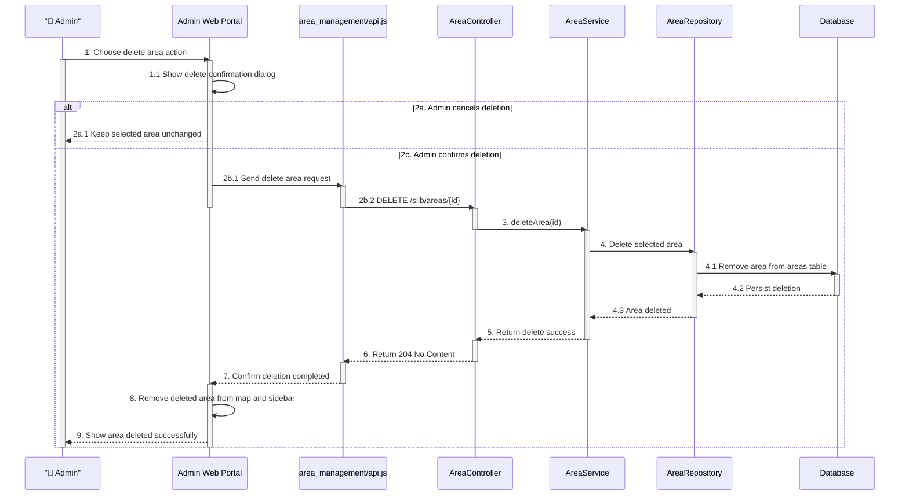

# FE-22c Delete Area

```mermaid
sequenceDiagram
    participant Users as "👤 Admin"
    participant Client as Admin Web Portal
    participant AreaApi as area_management/api.js
    participant AreaController as AreaController
    participant AreaService as AreaService
    participant AreaRepo as AreaRepository
    participant DB as Database

    Users->>Client: 1. Choose delete area action
    activate Users
    activate Client
    Client->>Client: 1.1 Show delete confirmation dialog

    alt 2a. Admin cancels deletion
        Client-->>Users: 2a.1 Keep selected area unchanged
    else 2b. Admin confirms deletion
        Client->>AreaApi: 2b.1 Send delete area request
        activate AreaApi
        AreaApi->>AreaController: 2b.2 DELETE /slib/areas/{id}
        deactivate AreaApi
        deactivate Client
        activate AreaController
        AreaController->>AreaService: 3. deleteArea(id)
        deactivate AreaController
        activate AreaService
        AreaService->>AreaRepo: 4. Delete selected area
        activate AreaRepo
        AreaRepo->>DB: 4.1 Remove area from areas table
        activate DB
        DB-->>AreaRepo: 4.2 Persist deletion
        deactivate DB
        AreaRepo-->>AreaService: 4.3 Area deleted
        deactivate AreaRepo
        AreaService-->>AreaController: 5. Return delete success
        deactivate AreaService
        activate AreaController
        AreaController-->>AreaApi: 6. Return 204 No Content
        deactivate AreaController
        activate AreaApi
        AreaApi-->>Client: 7. Confirm deletion completed
        deactivate AreaApi
        activate Client
        Client->>Client: 8. Remove deleted area from map and sidebar
        Client-->>Users: 9. Show area deleted successfully
    end

    deactivate Client
    deactivate Users
```
