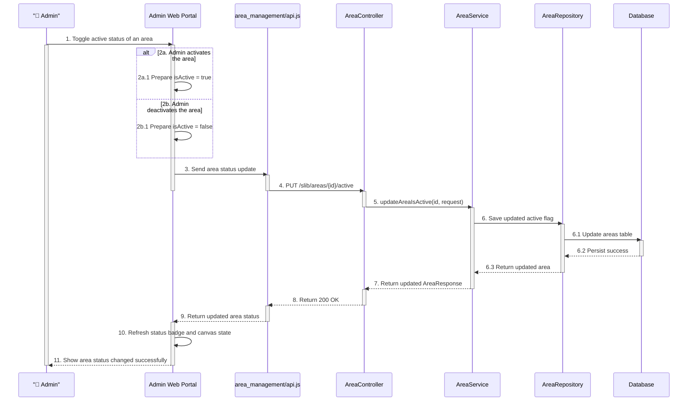

# FE-23 Change Area Status

```mermaid
sequenceDiagram
    participant Users as "👤 Admin"
    participant Client as Admin Web Portal
    participant AreaApi as area_management/api.js
    participant AreaController as AreaController
    participant AreaService as AreaService
    participant AreaRepo as AreaRepository
    participant DB as Database

    Users->>Client: 1. Toggle active status of an area
    activate Users
    activate Client

    alt 2a. Admin activates the area
        Client->>Client: 2a.1 Prepare isActive = true
    else 2b. Admin deactivates the area
        Client->>Client: 2b.1 Prepare isActive = false
    end

    Client->>AreaApi: 3. Send area status update
    activate AreaApi
    AreaApi->>AreaController: 4. PUT /slib/areas/{id}/active
    deactivate AreaApi
    deactivate Client
    activate AreaController
    AreaController->>AreaService: 5. updateAreaIsActive(id, request)
    deactivate AreaController
    activate AreaService
    AreaService->>AreaRepo: 6. Save updated active flag
    activate AreaRepo
    AreaRepo->>DB: 6.1 Update areas table
    activate DB
    DB-->>AreaRepo: 6.2 Persist success
    deactivate DB
    AreaRepo-->>AreaService: 6.3 Return updated area
    deactivate AreaRepo
    AreaService-->>AreaController: 7. Return updated AreaResponse
    deactivate AreaService
    activate AreaController
    AreaController-->>AreaApi: 8. Return 200 OK
    deactivate AreaController
    activate AreaApi
    AreaApi-->>Client: 9. Return updated area status
    deactivate AreaApi
    activate Client
    Client->>Client: 10. Refresh status badge and canvas state
    Client-->>Users: 11. Show area status changed successfully
    deactivate Client
    deactivate Users
```
