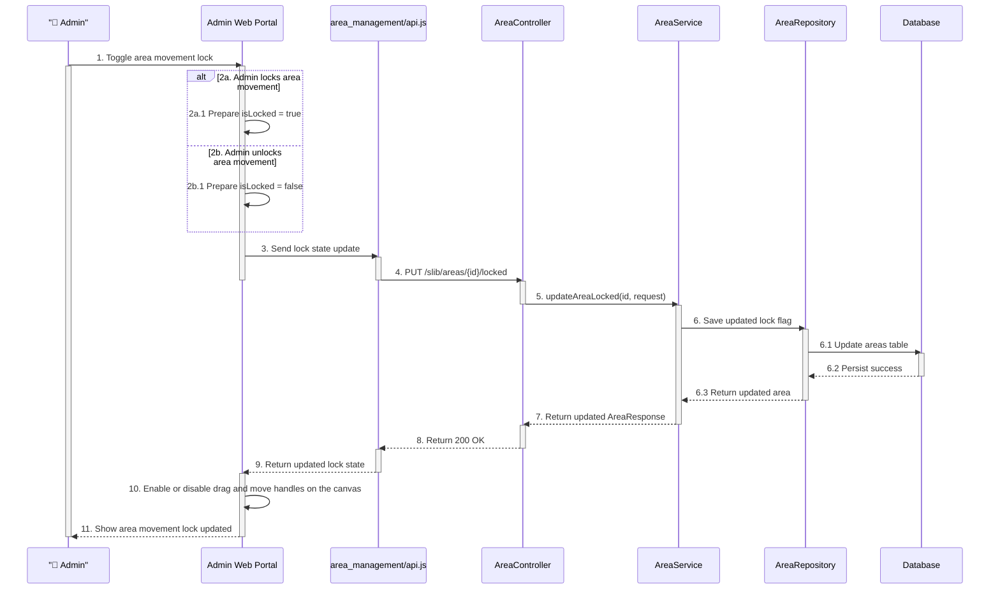

# FE-24 Lock Area Movement

```mermaid
sequenceDiagram
    participant Users as "👤 Admin"
    participant Client as Admin Web Portal
    participant AreaApi as area_management/api.js
    participant AreaController as AreaController
    participant AreaService as AreaService
    participant AreaRepo as AreaRepository
    participant DB as Database

    Users->>Client: 1. Toggle area movement lock
    activate Users
    activate Client

    alt 2a. Admin locks area movement
        Client->>Client: 2a.1 Prepare isLocked = true
    else 2b. Admin unlocks area movement
        Client->>Client: 2b.1 Prepare isLocked = false
    end

    Client->>AreaApi: 3. Send lock state update
    activate AreaApi
    AreaApi->>AreaController: 4. PUT /slib/areas/{id}/locked
    deactivate AreaApi
    deactivate Client
    activate AreaController
    AreaController->>AreaService: 5. updateAreaLocked(id, request)
    deactivate AreaController
    activate AreaService
    AreaService->>AreaRepo: 6. Save updated lock flag
    activate AreaRepo
    AreaRepo->>DB: 6.1 Update areas table
    activate DB
    DB-->>AreaRepo: 6.2 Persist success
    deactivate DB
    AreaRepo-->>AreaService: 6.3 Return updated area
    deactivate AreaRepo
    AreaService-->>AreaController: 7. Return updated AreaResponse
    deactivate AreaService
    activate AreaController
    AreaController-->>AreaApi: 8. Return 200 OK
    deactivate AreaController
    activate AreaApi
    AreaApi-->>Client: 9. Return updated lock state
    deactivate AreaApi
    activate Client
    Client->>Client: 10. Enable or disable drag and move handles on the canvas
    Client-->>Users: 11. Show area movement lock updated
    deactivate Client
    deactivate Users
```
