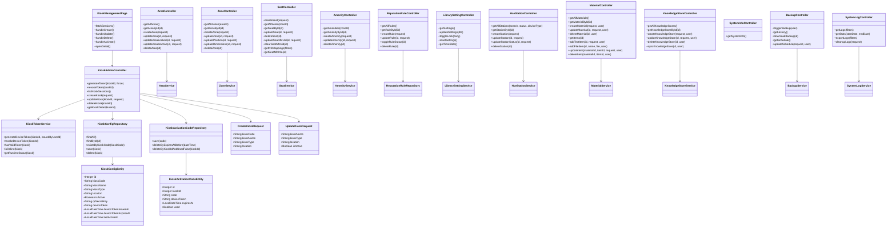

# System Configuration Module Class Diagram

```mermaid
classDiagram
    class AreaController {
        +getAllAreas()
        +getAreaById(id)
        +createArea(request)
        +updateArea(id, request)
        +updateAreaLocked(id, request)
        +updateAreaIsActive(id, request)
        +deleteArea(id)
    }

    class ZoneController {
        +getAllZones(areaId)
        +getZoneById(id)
        +createZone(request)
        +updateZone(id, request)
        +updatePosition(id, request)
        +updateDimensions(id, request)
        +deleteZone(id)
    }

    class SeatController {
        +createSeat(request)
        +getAllSeats(zoneId)
        +getSeatById(id)
        +updateSeat(id, request)
        +deleteSeat(id)
        +updateSeatNfcUid(id, request)
        +clearSeatNfcUid(id)
        +getNfcMappings(filters)
        +getSeatNfcInfo(id)
    }

    class AmenityController {
        +getAmenities(zoneId)
        +getAmenityById(id)
        +createAmenity(request)
        +updateAmenity(id, request)
        +deleteAmenity(id)
    }

    class ReputationRuleController {
        +getAllRules()
        +getRuleById(id)
        +createRule(request)
        +updateRule(id, request)
        +toggleRuleStatus(id)
        +deleteRule(id)
    }

    class LibrarySettingController {
        +getSettings()
        +updateSettings(dto)
        +toggleLock(body)
        +resetSettings()
        +getTimeSlots()
    }

    class HceStationController {
        +getAllStations(search, status, deviceType)
        +getStationById(id)
        +createStation(request)
        +updateStation(id, request)
        +updateStationStatus(id, request)
        +deleteStation(id)
    }

    class MaterialController {
        +getAllMaterials()
        +getMaterialById(id)
        +createMaterial(request, user)
        +updateMaterial(id, request, user)
        +deleteMaterial(id, user)
        +getItems(id)
        +addTextItem(id, request, user)
        +addFileItem(id, name, file, user)
        +updateItem(materialId, itemId, request, user)
        +deleteItem(materialId, itemId, user)
    }

    class KnowledgeStoreController {
        +getAllKnowledgeStores()
        +getKnowledgeStoreById(id)
        +createKnowledgeStore(request, user)
        +updateKnowledgeStore(id, request, user)
        +deleteKnowledgeStore(id, user)
        +syncKnowledgeStore(id, user)
    }

    class KioskAdminController {
        +generateToken(kioskId, force)
        +revokeToken(kioskId)
        +listKioskSessions()
        +createKiosk(request)
        +updateKiosk(kioskId, request)
        +deleteKiosk(kioskId)
        +getKioskDetail(kioskId)
    }

    class BackupController {
        +triggerBackup(user)
        +getHistory()
        +downloadBackup(id)
        +getSchedule()
        +updateSchedule(request, user)
    }

    class SystemInfoController {
        +getSystemInfo()
    }

    class SystemLogController {
        +getLogs(filters)
        +getStats(startDate, endDate)
        +exportLogs(filters)
        +cleanupLogs(request)
    }

    class KioskTokenService {
        +generateDeviceToken(kioskId, issuedByUserId)
        +revokeDeviceToken(kioskId)
        +hasValidToken(kiosk)
        +isOnline(kiosk)
        +getRuntimeStatus(kiosk)
    }

    class KioskConfigRepository {
        +findAll()
        +findById(id)
        +existsByKioskCode(kioskCode)
        +save(kiosk)
        +delete(kiosk)
    }

    class KioskActivationCodeRepository {
        +save(code)
        +deleteByExpiresAtBefore(dateTime)
        +deleteByKioskIdAndUsedFalse(kioskId)
    }

    class KioskConfigEntity {
        +Integer id
        +String kioskCode
        +String kioskName
        +String kioskType
        +String location
        +Boolean isActive
        +String qrSecretKey
        +String deviceToken
        +LocalDateTime deviceTokenIssuedAt
        +LocalDateTime deviceTokenExpiresAt
        +LocalDateTime lastActiveAt
    }

    class KioskActivationCodeEntity {
        +Integer id
        +Integer kioskId
        +String code
        +String deviceToken
        +LocalDateTime expiresAt
        +Boolean used
    }

    class CreateKioskRequest {
        +String kioskCode
        +String kioskName
        +String kioskType
        +String location
    }

    class UpdateKioskRequest {
        +String kioskName
        +String kioskType
        +String location
        +Boolean isActive
    }

    class KioskManagementPage {
        +fetchSessions()
        +handleCreate()
        +handleUpdate()
        +handleDelete()
        +handleActivate()
        +openDetail()
    }

    AreaController --> AreaService
    ZoneController --> ZoneService
    SeatController --> SeatService
    AmenityController --> AmenityService
    ReputationRuleController --> ReputationRuleRepository
    LibrarySettingController --> LibrarySettingService
    HceStationController --> HceStationService
    MaterialController --> MaterialService
    KnowledgeStoreController --> KnowledgeStoreService
    KioskAdminController --> KioskTokenService
    KioskAdminController --> KioskConfigRepository
    KioskAdminController --> KioskActivationCodeRepository
    KioskConfigRepository --> KioskConfigEntity
    KioskActivationCodeRepository --> KioskActivationCodeEntity
    KioskAdminController --> CreateKioskRequest
    KioskAdminController --> UpdateKioskRequest
    KioskManagementPage --> KioskAdminController
    BackupController --> BackupService
    SystemLogController --> SystemLogService
```
