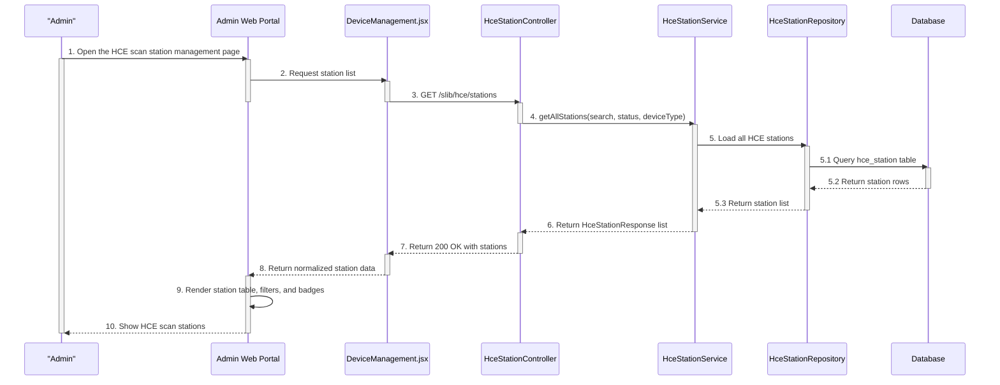

# FE-40 View HCE Scan Stations

```mermaid
sequenceDiagram
    participant Users as "Admin"
    participant Client as Admin Web Portal
    participant HcePage as DeviceManagement.jsx
    participant StationController as HceStationController
    participant StationService as HceStationService
    participant StationRepo as HceStationRepository
    participant DB as Database

    Users->>Client: 1. Open the HCE scan station management page
    activate Users
    activate Client
    Client->>HcePage: 2. Request station list
    activate HcePage
    HcePage->>StationController: 3. GET /slib/hce/stations
    deactivate HcePage
    deactivate Client
    activate StationController
    StationController->>StationService: 4. getAllStations(search, status, deviceType)
    deactivate StationController
    activate StationService
    StationService->>StationRepo: 5. Load all HCE stations
    activate StationRepo
    StationRepo->>DB: 5.1 Query hce_station table
    activate DB
    DB-->>StationRepo: 5.2 Return station rows
    deactivate DB
    StationRepo-->>StationService: 5.3 Return station list
    deactivate StationRepo
    StationService-->>StationController: 6. Return HceStationResponse list
    deactivate StationService
    activate StationController
    StationController-->>HcePage: 7. Return 200 OK with stations
    deactivate StationController
    activate HcePage
    HcePage-->>Client: 8. Return normalized station data
    deactivate HcePage
    activate Client
    Client->>Client: 9. Render station table, filters, and badges
    Client-->>Users: 10. Show HCE scan stations
    deactivate Client
    deactivate Users
```
