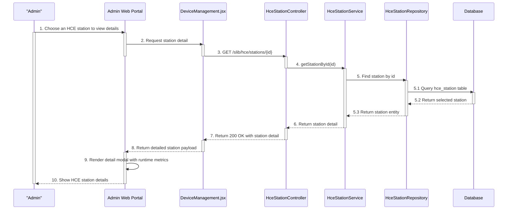

# FE-41 View HCE Scan Station Details

```mermaid
sequenceDiagram
    participant Users as "Admin"
    participant Client as Admin Web Portal
    participant HcePage as DeviceManagement.jsx
    participant StationController as HceStationController
    participant StationService as HceStationService
    participant StationRepo as HceStationRepository
    participant DB as Database

    Users->>Client: 1. Choose an HCE station to view details
    activate Users
    activate Client
    Client->>HcePage: 2. Request station detail
    activate HcePage
    HcePage->>StationController: 3. GET /slib/hce/stations/{id}
    deactivate HcePage
    deactivate Client
    activate StationController
    StationController->>StationService: 4. getStationById(id)
    deactivate StationController
    activate StationService
    StationService->>StationRepo: 5. Find station by id
    activate StationRepo
    StationRepo->>DB: 5.1 Query hce_station table
    activate DB
    DB-->>StationRepo: 5.2 Return selected station
    deactivate DB
    StationRepo-->>StationService: 5.3 Return station entity
    deactivate StationRepo
    StationService-->>StationController: 6. Return station detail
    deactivate StationService
    activate StationController
    StationController-->>HcePage: 7. Return 200 OK with station detail
    deactivate StationController
    activate HcePage
    HcePage-->>Client: 8. Return detailed station payload
    deactivate HcePage
    activate Client
    Client->>Client: 9. Render detail modal with runtime metrics
    Client-->>Users: 10. Show HCE station details
    deactivate Client
    deactivate Users
```
