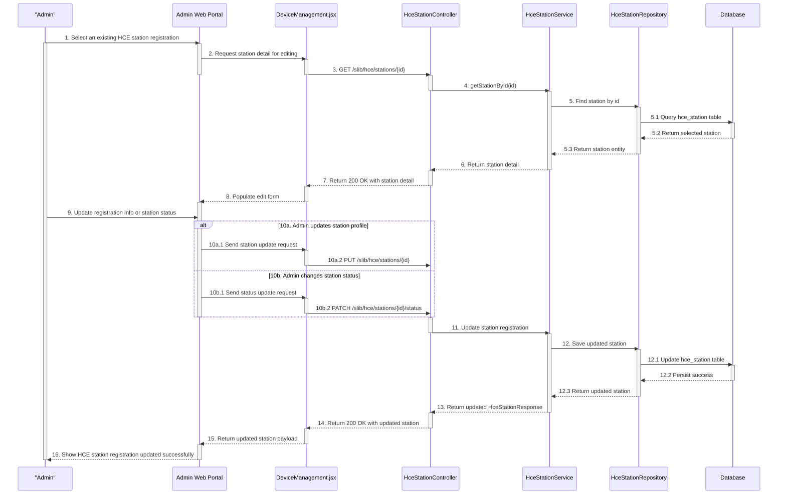

# FE-42a View and Update HCE Station Registration

```mermaid
sequenceDiagram
    participant Users as "Admin"
    participant Client as Admin Web Portal
    participant HcePage as DeviceManagement.jsx
    participant StationController as HceStationController
    participant StationService as HceStationService
    participant StationRepo as HceStationRepository
    participant DB as Database

    Users->>Client: 1. Select an existing HCE station registration
    activate Users
    activate Client
    Client->>HcePage: 2. Request station detail for editing
    activate HcePage
    HcePage->>StationController: 3. GET /slib/hce/stations/{id}
    deactivate HcePage
    deactivate Client
    activate StationController
    StationController->>StationService: 4. getStationById(id)
    deactivate StationController
    activate StationService
    StationService->>StationRepo: 5. Find station by id
    activate StationRepo
    StationRepo->>DB: 5.1 Query hce_station table
    activate DB
    DB-->>StationRepo: 5.2 Return selected station
    deactivate DB
    StationRepo-->>StationService: 5.3 Return station entity
    deactivate StationRepo
    StationService-->>StationController: 6. Return station detail
    deactivate StationService
    activate StationController
    StationController-->>HcePage: 7. Return 200 OK with station detail
    deactivate StationController
    activate HcePage
    HcePage-->>Client: 8. Populate edit form
    deactivate HcePage
    activate Client
    Users->>Client: 9. Update registration info or station status

    alt 10a. Admin updates station profile
        Client->>HcePage: 10a.1 Send station update request
        activate HcePage
        HcePage->>StationController: 10a.2 PUT /slib/hce/stations/{id}
        deactivate HcePage
    else 10b. Admin changes station status
        Client->>HcePage: 10b.1 Send status update request
        activate HcePage
        HcePage->>StationController: 10b.2 PATCH /slib/hce/stations/{id}/status
        deactivate HcePage
    end

    deactivate Client
    activate StationController
    StationController->>StationService: 11. Update station registration
    deactivate StationController
    activate StationService
    StationService->>StationRepo: 12. Save updated station
    activate StationRepo
    StationRepo->>DB: 12.1 Update hce_station table
    activate DB
    DB-->>StationRepo: 12.2 Persist success
    deactivate DB
    StationRepo-->>StationService: 12.3 Return updated station
    deactivate StationRepo
    StationService-->>StationController: 13. Return updated HceStationResponse
    deactivate StationService
    activate StationController
    StationController-->>HcePage: 14. Return 200 OK with updated station
    deactivate StationController
    activate HcePage
    HcePage-->>Client: 15. Return updated station payload
    deactivate HcePage
    activate Client
    Client-->>Users: 16. Show HCE station registration updated successfully
    deactivate Client
    deactivate Users
```
