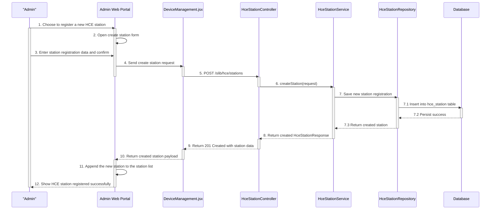

# FE-42b Create HCE Station Registration

```mermaid
sequenceDiagram
    participant Users as "Admin"
    participant Client as Admin Web Portal
    participant HcePage as DeviceManagement.jsx
    participant StationController as HceStationController
    participant StationService as HceStationService
    participant StationRepo as HceStationRepository
    participant DB as Database

    Users->>Client: 1. Choose to register a new HCE station
    activate Users
    activate Client
    Client->>Client: 2. Open create station form
    Users->>Client: 3. Enter station registration data and confirm
    Client->>HcePage: 4. Send create station request
    activate HcePage
    HcePage->>StationController: 5. POST /slib/hce/stations
    deactivate HcePage
    deactivate Client
    activate StationController
    StationController->>StationService: 6. createStation(request)
    deactivate StationController
    activate StationService
    StationService->>StationRepo: 7. Save new station registration
    activate StationRepo
    StationRepo->>DB: 7.1 Insert into hce_station table
    activate DB
    DB-->>StationRepo: 7.2 Persist success
    deactivate DB
    StationRepo-->>StationService: 7.3 Return created station
    deactivate StationRepo
    StationService-->>StationController: 8. Return created HceStationResponse
    deactivate StationService
    activate StationController
    StationController-->>HcePage: 9. Return 201 Created with station data
    deactivate StationController
    activate HcePage
    HcePage-->>Client: 10. Return created station payload
    deactivate HcePage
    activate Client
    Client->>Client: 11. Append the new station to the station list
    Client-->>Users: 12. Show HCE station registered successfully
    deactivate Client
    deactivate Users
```
