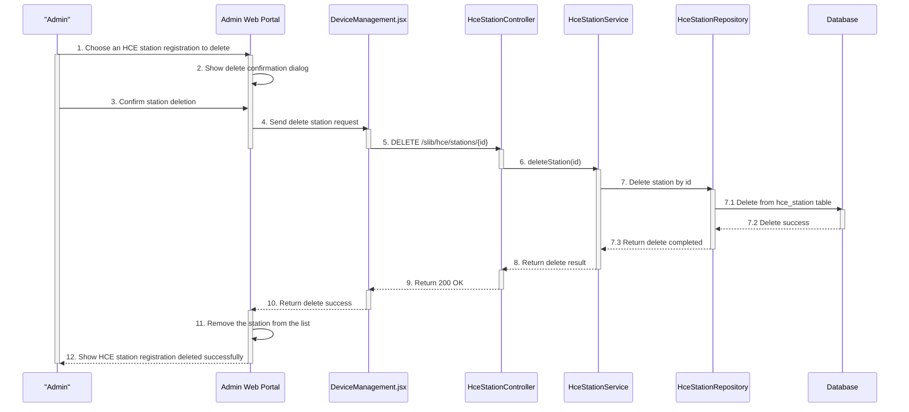

# FE-42c Delete HCE Station Registration

```mermaid
sequenceDiagram
    participant Users as "Admin"
    participant Client as Admin Web Portal
    participant HcePage as DeviceManagement.jsx
    participant StationController as HceStationController
    participant StationService as HceStationService
    participant StationRepo as HceStationRepository
    participant DB as Database

    Users->>Client: 1. Choose an HCE station registration to delete
    activate Users
    activate Client
    Client->>Client: 2. Show delete confirmation dialog
    Users->>Client: 3. Confirm station deletion
    Client->>HcePage: 4. Send delete station request
    activate HcePage
    HcePage->>StationController: 5. DELETE /slib/hce/stations/{id}
    deactivate HcePage
    deactivate Client
    activate StationController
    StationController->>StationService: 6. deleteStation(id)
    deactivate StationController
    activate StationService
    StationService->>StationRepo: 7. Delete station by id
    activate StationRepo
    StationRepo->>DB: 7.1 Delete from hce_station table
    activate DB
    DB-->>StationRepo: 7.2 Delete success
    deactivate DB
    StationRepo-->>StationService: 7.3 Return delete completed
    deactivate StationRepo
    StationService-->>StationController: 8. Return delete result
    deactivate StationService
    activate StationController
    StationController-->>HcePage: 9. Return 200 OK
    deactivate StationController
    activate HcePage
    HcePage-->>Client: 10. Return delete success
    deactivate HcePage
    activate Client
    Client->>Client: 11. Remove the station from the list
    Client-->>Users: 12. Show HCE station registration deleted successfully
    deactivate Client
    deactivate Users
```
