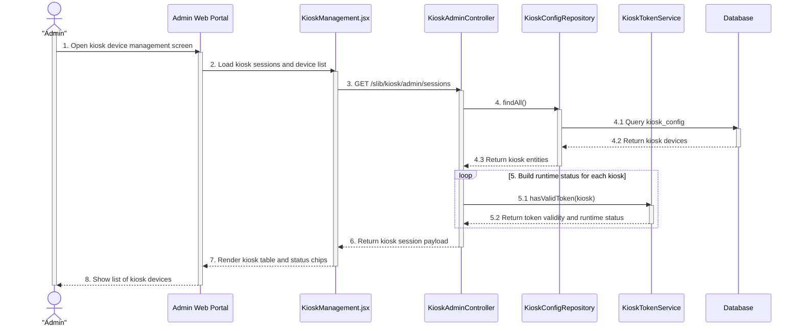

# FE-52 View List of Kiosk Devices

```mermaid
sequenceDiagram
    actor Admin as "Admin"
    participant Client as Admin Web Portal
    participant KioskPage as KioskManagement.jsx
    participant KioskController as KioskAdminController
    participant KioskRepo as KioskConfigRepository
    participant TokenService as KioskTokenService
    participant DB as Database

    activate Admin
    Admin->>Client: 1. Open kiosk device management screen
    activate Client
    
    Client->>KioskPage: 2. Load kiosk sessions and device list
    activate KioskPage
    
    # Giai đoạn: Truy vấn danh sách thiết bị
    KioskPage->>KioskController: 3. GET /slib/kiosk/admin/sessions
    activate KioskController
    
    KioskController->>KioskRepo: 4. findAll()
    activate KioskRepo
    KioskRepo->>DB: 4.1 Query kiosk_config
    activate DB
    DB-->>KioskRepo: 4.2 Return kiosk devices
    deactivate DB
    KioskRepo-->>KioskController: 4.3 Return kiosk entities
    deactivate KioskRepo

    # Giai đoạn: Kiểm tra trạng thái Runtime (Token)
    loop 5. Build runtime status for each kiosk
        KioskController->>TokenService: 5.1 hasValidToken(kiosk)
        activate TokenService
        TokenService-->>KioskController: 5.2 Return token validity and runtime status
        deactivate TokenService
    end

    # Trả kết quả về giao diện
    KioskController-->>KioskPage: 6. Return kiosk session payload
    deactivate KioskController
    
    KioskPage-->>Client: 7. Render kiosk table and status chips
    deactivate KioskPage
    
    Client-->>Admin: 8. Show list of kiosk devices
    
    deactivate Client
    deactivate Admin
```
