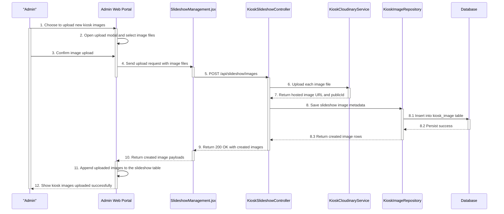

# FE-52b Create Kiosk Image

```mermaid
sequenceDiagram
    participant Users as "Admin"
    participant Client as Admin Web Portal
    participant SlidePage as SlideshowManagement.jsx
    participant SlideController as KioskSlideshowController
    participant CloudinaryService as KioskCloudinaryService
    participant ImageRepo as KioskImageRepository
    participant DB as Database

    Users->>Client: 1. Choose to upload new kiosk images
    activate Users
    activate Client
    Client->>Client: 2. Open upload modal and select image files
    Users->>Client: 3. Confirm image upload
    Client->>SlidePage: 4. Send upload request with image files
    activate SlidePage
    SlidePage->>SlideController: 5. POST /api/slideshow/images
    deactivate SlidePage
    deactivate Client
    activate SlideController
    SlideController->>CloudinaryService: 6. Upload each image file
    activate CloudinaryService
    CloudinaryService-->>SlideController: 7. Return hosted image URL and publicId
    deactivate CloudinaryService
    SlideController->>ImageRepo: 8. Save slideshow image metadata
    activate ImageRepo
    ImageRepo->>DB: 8.1 Insert into kiosk_image table
    activate DB
    DB-->>ImageRepo: 8.2 Persist success
    deactivate DB
    ImageRepo-->>SlideController: 8.3 Return created image rows
    deactivate ImageRepo
    SlideController-->>SlidePage: 9. Return 200 OK with created images
    deactivate SlideController
    activate SlidePage
    SlidePage-->>Client: 10. Return created image payloads
    deactivate SlidePage
    activate Client
    Client->>Client: 11. Append uploaded images to the slideshow table
    Client-->>Users: 12. Show kiosk images uploaded successfully
    deactivate Client
    deactivate Users
```
