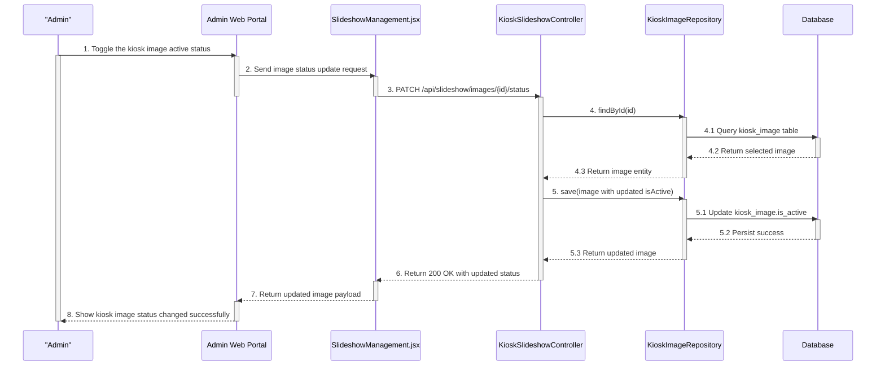

# FE-53 Change Image Status

```mermaid
sequenceDiagram
    participant Users as "Admin"
    participant Client as Admin Web Portal
    participant SlidePage as SlideshowManagement.jsx
    participant SlideController as KioskSlideshowController
    participant ImageRepo as KioskImageRepository
    participant DB as Database

    Users->>Client: 1. Toggle the kiosk image active status
    activate Users
    activate Client
    Client->>SlidePage: 2. Send image status update request
    activate SlidePage
    SlidePage->>SlideController: 3. PATCH /api/slideshow/images/{id}/status
    deactivate SlidePage
    deactivate Client
    activate SlideController
    SlideController->>ImageRepo: 4. findById(id)
    activate ImageRepo
    ImageRepo->>DB: 4.1 Query kiosk_image table
    activate DB
    DB-->>ImageRepo: 4.2 Return selected image
    deactivate DB
    ImageRepo-->>SlideController: 4.3 Return image entity
    deactivate ImageRepo
    SlideController->>ImageRepo: 5. save(image with updated isActive)
    activate ImageRepo
    ImageRepo->>DB: 5.1 Update kiosk_image.is_active
    activate DB
    DB-->>ImageRepo: 5.2 Persist success
    deactivate DB
    ImageRepo-->>SlideController: 5.3 Return updated image
    deactivate ImageRepo
    SlideController-->>SlidePage: 6. Return 200 OK with updated status
    deactivate SlideController
    activate SlidePage
    SlidePage-->>Client: 7. Return updated image payload
    deactivate SlidePage
    activate Client
    Client-->>Users: 8. Show kiosk image status changed successfully
    deactivate Client
    deactivate Users
```
