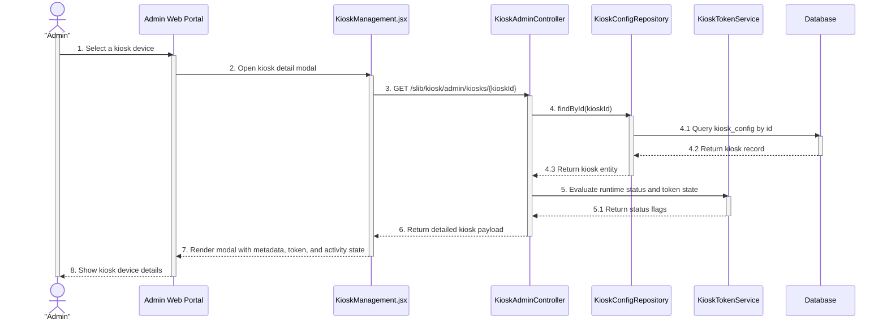

# FE-53 View Kiosk Device Details

```mermaid
sequenceDiagram
    actor Admin as "Admin"
    participant Client as Admin Web Portal
    participant KioskPage as KioskManagement.jsx
    participant KioskController as KioskAdminController
    participant KioskRepo as KioskConfigRepository
    participant TokenService as KioskTokenService
    participant DB as Database

    activate Admin
    Admin->>Client: 1. Select a kiosk device
    activate Client
    
    Client->>KioskPage: 2. Open kiosk detail modal
    activate KioskPage
    
    # Giai đoạn: Truy vấn chi tiết thiết bị qua ID
    KioskPage->>KioskController: 3. GET /slib/kiosk/admin/kiosks/{kioskId}
    activate KioskController
    
    KioskController->>KioskRepo: 4. findById(kioskId)
    activate KioskRepo
    KioskRepo->>DB: 4.1 Query kiosk_config by id
    activate DB
    DB-->>KioskRepo: 4.2 Return kiosk record
    deactivate DB
    KioskRepo-->>KioskController: 4.3 Return kiosk entity
    deactivate KioskRepo

    # Giai đoạn: Kiểm tra trạng thái thực thi và mã Token
    KioskController->>TokenService: 5. Evaluate runtime status and token state
    activate TokenService
    TokenService-->>KioskController: 5.1 Return status flags
    deactivate TokenService

    # Phản hồi dữ liệu về Modal
    KioskController-->>KioskPage: 6. Return detailed kiosk payload
    deactivate KioskController
    
    KioskPage-->>Client: 7. Render modal with metadata, token, and activity state
    deactivate KioskPage
    
    Client-->>Admin: 8. Show kiosk device details
    
    deactivate Client
    deactivate Admin
```
