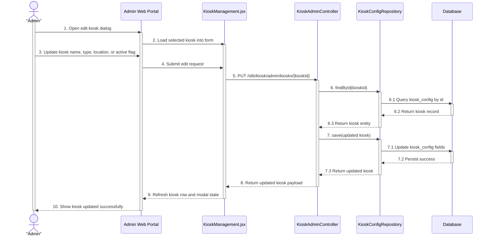

# FE-54a View and Update Kiosk Device

```mermaid
sequenceDiagram
    actor Admin as "Admin"
    participant Client as Admin Web Portal
    participant KioskPage as KioskManagement.jsx
    participant KioskController as KioskAdminController
    participant KioskRepo as KioskConfigRepository
    participant DB as Database

    activate Admin
    Admin->>Client: 1. Open edit kiosk dialog
    activate Client
    
    Client->>KioskPage: 2. Load selected kiosk into form
    activate KioskPage
    
    Admin->>Client: 3. Update kiosk name, type, location, or active flag
    
    # Giai đoạn: Gửi yêu cầu cập nhật
    Client->>KioskPage: 4. Submit edit request
    KioskPage->>KioskController: 5. PUT /slib/kiosk/admin/kiosks/{kioskId}
    activate KioskController
    
    # Bước 6: Kiểm tra bản ghi trước khi lưu
    KioskController->>KioskRepo: 6. findById(kioskId)
    activate KioskRepo
    KioskRepo->>DB: 6.1 Query kiosk_config by id
    activate DB
    DB-->>KioskRepo: 6.2 Return kiosk record
    deactivate DB
    KioskRepo-->>KioskController: 6.3 Return kiosk entity
    deactivate KioskRepo

    # Bước 7: Thực thi lưu thay đổi
    KioskController->>KioskRepo: 7. save(updated kiosk)
    activate KioskRepo
    KioskRepo->>DB: 7.1 Update kiosk_config fields
    activate DB
    DB-->>KioskRepo: 7.2 Persist success
    deactivate DB
    KioskRepo-->>KioskController: 7.3 Return updated kiosk
    deactivate KioskRepo

    # Phản hồi kết quả và cập nhật UI
    KioskController-->>KioskPage: 8. Return updated kiosk payload
    deactivate KioskController
    
    KioskPage-->>Client: 9. Refresh kiosk row and modal state
    deactivate KioskPage
    
    Client-->>Admin: 10. Show kiosk updated successfully
    
    deactivate Client
    deactivate Admin
```
