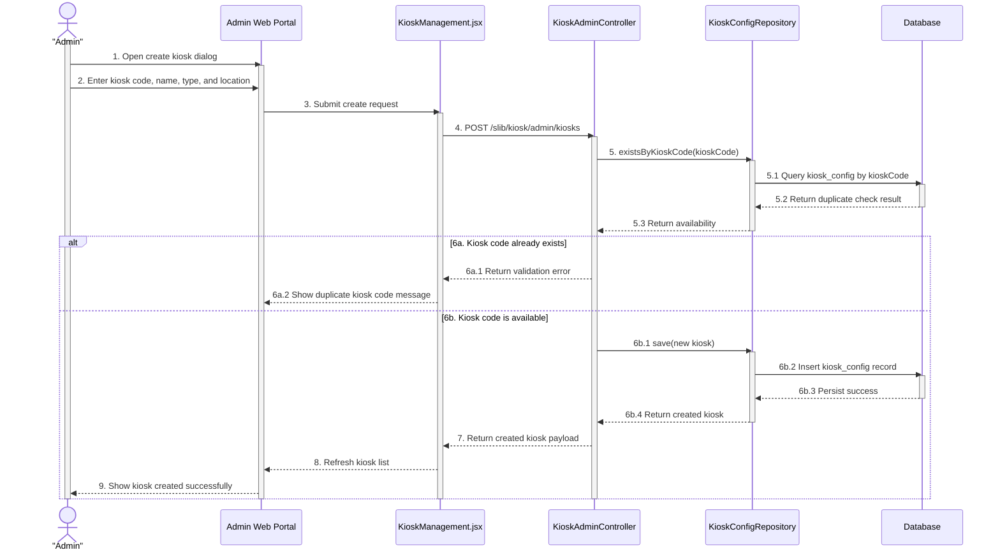

# FE-54b Create Kiosk Device

```mermaid
sequenceDiagram
    actor Admin as "Admin"
    participant Client as Admin Web Portal
    participant KioskPage as KioskManagement.jsx
    participant KioskController as KioskAdminController
    participant KioskRepo as KioskConfigRepository
    participant DB as Database

    activate Admin
    Admin->>Client: 1. Open create kiosk dialog
    activate Client
    Admin->>Client: 2. Enter kiosk code, name, type, and location
    
    # Giai đoạn: Gửi yêu cầu tạo mới
    Client->>KioskPage: 3. Submit create request
    activate KioskPage
    KioskPage->>KioskController: 4. POST /slib/kiosk/admin/kiosks
    activate KioskController
    
    # Bước 5: Kiểm tra trùng lặp (Validation)
    KioskController->>KioskRepo: 5. existsByKioskCode(kioskCode)
    activate KioskRepo
    KioskRepo->>DB: 5.1 Query kiosk_config by kioskCode
    activate DB
    DB-->>KioskRepo: 5.2 Return duplicate check result
    deactivate DB
    KioskRepo-->>KioskController: 5.3 Return availability
    deactivate KioskRepo

    alt 6a. Kiosk code already exists
        KioskController-->>KioskPage: 6a.1 Return validation error
        KioskPage-->>Client: 6a.2 Show duplicate kiosk code message
    else 6b. Kiosk code is available
        KioskController->>KioskRepo: 6b.1 save(new kiosk)
        activate KioskRepo
        KioskRepo->>DB: 6b.2 Insert kiosk_config record
        activate DB
        DB-->>KioskRepo: 6b.3 Persist success
        deactivate DB
        KioskRepo-->>KioskController: 6b.4 Return created kiosk
        deactivate KioskRepo
        
        KioskController-->>KioskPage: 7. Return created kiosk payload
        KioskPage-->>Client: 8. Refresh kiosk list
        Client-->>Admin: 9. Show kiosk created successfully
    end
    
    deactivate KioskController
    deactivate KioskPage
    deactivate Client
    deactivate Admin
```
