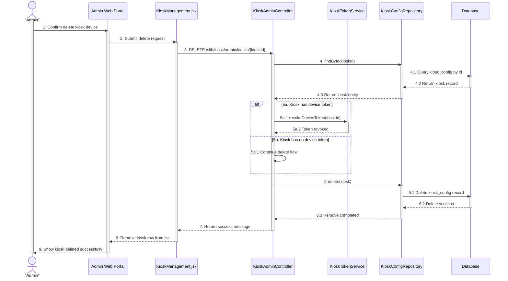

# FE-54c Delete Kiosk Device

```mermaid
sequenceDiagram
    actor Admin as "Admin"
    participant Client as Admin Web Portal
    participant KioskPage as KioskManagement.jsx
    participant KioskController as KioskAdminController
    participant TokenService as KioskTokenService
    participant KioskRepo as KioskConfigRepository
    participant DB as Database

    activate Admin
    Admin->>Client: 1. Confirm delete kiosk device
    activate Client
    
    Client->>KioskPage: 2. Submit delete request
    activate KioskPage
    
    # Giai đoạn: Gọi API xóa thiết bị
    KioskPage->>KioskController: 3. DELETE /slib/kiosk/admin/kiosks/{kioskId}
    activate KioskController
    
    # Bước 4: Kiểm tra sự tồn tại của thiết bị
    KioskController->>KioskRepo: 4. findById(kioskId)
    activate KioskRepo
    KioskRepo->>DB: 4.1 Query kiosk_config by id
    activate DB
    DB-->>KioskRepo: 4.2 Return kiosk record
    deactivate DB
    KioskRepo-->>KioskController: 4.3 Return kiosk entity
    deactivate KioskRepo

    # Bước 5: Xử lý thu hồi Token (Logic rẽ nhánh)
    alt 5a. Kiosk has device token
        KioskController->>TokenService: 5a.1 revokeDeviceToken(kioskId)
        activate TokenService
        TokenService-->>KioskController: 5a.2 Token revoked
        deactivate TokenService
    else 5b. Kiosk has no device token
        KioskController->>KioskController: 5b.1 Continue delete flow
    end

    # Bước 6: Thực thi xóa vĩnh viễn trong DB
    KioskController->>KioskRepo: 6. delete(kiosk)
    activate KioskRepo
    KioskRepo->>DB: 6.1 Delete kiosk_config record
    activate DB
    DB-->>KioskRepo: 6.2 Delete success
    deactivate DB
    KioskRepo-->>KioskController: 6.3 Remove completed
    deactivate KioskRepo

    # Phản hồi về giao diện
    KioskController-->>KioskPage: 7. Return success message
    deactivate KioskController
    
    KioskPage-->>Client: 8. Remove kiosk row from list
    deactivate KioskPage
    
    Client-->>Admin: 9. Show kiosk deleted successfully
    
    deactivate Client
    deactivate Admin
```
