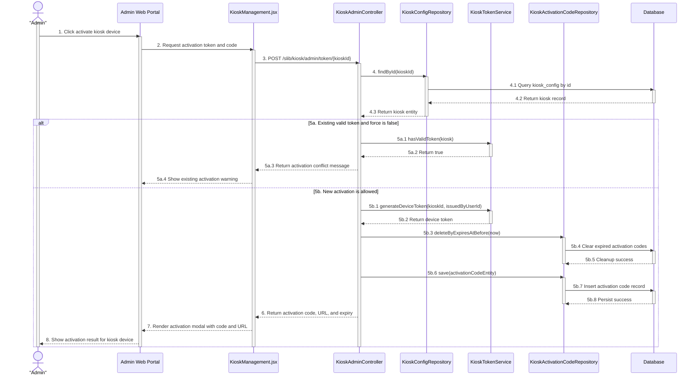

# FE-55 Activate Kiosk Device

```mermaid
sequenceDiagram
    actor Admin as "Admin"
    participant Client as Admin Web Portal
    participant KioskPage as KioskManagement.jsx
    participant KioskController as KioskAdminController
    participant KioskRepo as KioskConfigRepository
    participant TokenService as KioskTokenService
    participant ActivationRepo as KioskActivationCodeRepository
    participant DB as Database

    activate Admin
    Admin->>Client: 1. Click activate kiosk device
    activate Client
    
    Client->>KioskPage: 2. Request activation token and code
    activate KioskPage
    
    # Giai đoạn: Gọi API kích hoạt
    KioskPage->>KioskController: 3. POST /slib/kiosk/admin/token/{kioskId}
    activate KioskController
    
    # Bước 4: Kiểm tra thiết bị
    KioskController->>KioskRepo: 4. findById(kioskId)
    activate KioskRepo
    KioskRepo->>DB: 4.1 Query kiosk_config by id
    activate DB
    DB-->>KioskRepo: 4.2 Return kiosk record
    deactivate DB
    KioskRepo-->>KioskController: 4.3 Return kiosk entity
    deactivate KioskRepo

    # Logic xử lý kích hoạt (Alt/Else)
    alt 5a. Existing valid token and force is false
        KioskController->>TokenService: 5a.1 hasValidToken(kiosk)
        activate TokenService
        TokenService-->>KioskController: 5a.2 Return true
        deactivate TokenService
        KioskController-->>KioskPage: 5a.3 Return activation conflict message
        KioskPage-->>Client: 5a.4 Show existing activation warning
    else 5b. New activation is allowed
        # 5b.1 & 5b.2: Tạo Device Token
        KioskController->>TokenService: 5b.1 generateDeviceToken(kioskId, issuedByUserId)
        activate TokenService
        TokenService-->>KioskController: 5b.2 Return device token
        deactivate TokenService
        
        # 5b.3 - 5b.5: Dọn dẹp mã cũ hết hạn
        KioskController->>ActivationRepo: 5b.3 deleteByExpiresAtBefore(now)
        activate ActivationRepo
        ActivationRepo->>DB: 5b.4 Clear expired activation codes
        activate DB
        DB-->>ActivationRepo: 5b.5 Cleanup success
        deactivate DB
        deactivate ActivationRepo
        
        # 5b.6 - 5b.8: Lưu mã kích hoạt mới
        KioskController->>ActivationRepo: 5b.6 save(activationCodeEntity)
        activate ActivationRepo
        ActivationRepo->>DB: 5b.7 Insert activation code record
        activate DB
        DB-->>ActivationRepo: 5b.8 Persist success
        deactivate DB
        deactivate ActivationRepo
        
        # Phản hồi kết quả về UI
        KioskController-->>KioskPage: 6. Return activation code, URL, and expiry
        KioskPage-->>Client: 7. Render activation modal with code and URL
        Client-->>Admin: 8. Show activation result for kiosk device
    end

    deactivate KioskController
    deactivate KioskPage
    deactivate Client
    deactivate Admin
```
