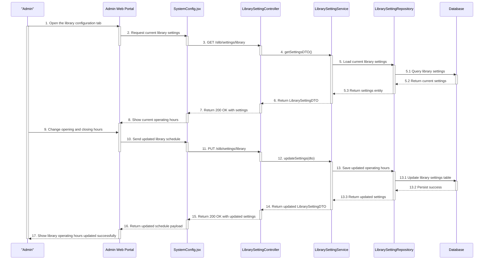

# FE-36 Set Library Operating Hours

```mermaid
sequenceDiagram
    participant Users as "Admin"
    participant Client as Admin Web Portal
    participant ConfigPage as SystemConfig.jsx
    participant SettingController as LibrarySettingController
    participant SettingService as LibrarySettingService
    participant SettingRepo as LibrarySettingRepository
    participant DB as Database

    Users->>Client: 1. Open the library configuration tab
    activate Users
    activate Client
    Client->>ConfigPage: 2. Request current library settings
    activate ConfigPage
    ConfigPage->>SettingController: 3. GET /slib/settings/library
    deactivate ConfigPage
    deactivate Client
    activate SettingController
    SettingController->>SettingService: 4. getSettingsDTO()
    deactivate SettingController
    activate SettingService
    SettingService->>SettingRepo: 5. Load current library settings
    activate SettingRepo
    SettingRepo->>DB: 5.1 Query library settings
    activate DB
    DB-->>SettingRepo: 5.2 Return current settings
    deactivate DB
    SettingRepo-->>SettingService: 5.3 Return settings entity
    deactivate SettingRepo
    SettingService-->>SettingController: 6. Return LibrarySettingDTO
    deactivate SettingService
    activate SettingController
    SettingController-->>ConfigPage: 7. Return 200 OK with settings
    deactivate SettingController
    activate ConfigPage
    ConfigPage-->>Client: 8. Show current operating hours
    deactivate ConfigPage
    activate Client
    Users->>Client: 9. Change opening and closing hours
    Client->>ConfigPage: 10. Send updated library schedule
    activate ConfigPage
    ConfigPage->>SettingController: 11. PUT /slib/settings/library
    deactivate ConfigPage
    deactivate Client
    activate SettingController
    SettingController->>SettingService: 12. updateSettings(dto)
    deactivate SettingController
    activate SettingService
    SettingService->>SettingRepo: 13. Save updated operating hours
    activate SettingRepo
    SettingRepo->>DB: 13.1 Update library settings table
    activate DB
    DB-->>SettingRepo: 13.2 Persist success
    deactivate DB
    SettingRepo-->>SettingService: 13.3 Return updated settings
    deactivate SettingRepo
    SettingService-->>SettingController: 14. Return updated LibrarySettingDTO
    deactivate SettingService
    activate SettingController
    SettingController-->>ConfigPage: 15. Return 200 OK with updated settings
    deactivate SettingController
    activate ConfigPage
    ConfigPage-->>Client: 16. Return updated schedule payload
    deactivate ConfigPage
    activate Client
    Client-->>Users: 17. Show library operating hours updated successfully
    deactivate Client
    deactivate Users
```
