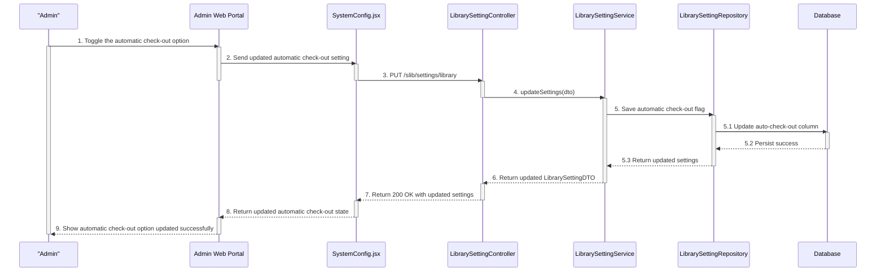

# FE-38 Turn On/Turn Off Automatic Check-Out

```mermaid
sequenceDiagram
    participant Users as "Admin"
    participant Client as Admin Web Portal
    participant ConfigPage as SystemConfig.jsx
    participant SettingController as LibrarySettingController
    participant SettingService as LibrarySettingService
    participant SettingRepo as LibrarySettingRepository
    participant DB as Database

    Users->>Client: 1. Toggle the automatic check-out option
    activate Users
    activate Client
    Client->>ConfigPage: 2. Send updated automatic check-out setting
    activate ConfigPage
    ConfigPage->>SettingController: 3. PUT /slib/settings/library
    deactivate ConfigPage
    deactivate Client
    activate SettingController
    SettingController->>SettingService: 4. updateSettings(dto)
    deactivate SettingController
    activate SettingService
    SettingService->>SettingRepo: 5. Save automatic check-out flag
    activate SettingRepo
    SettingRepo->>DB: 5.1 Update auto-check-out column
    activate DB
    DB-->>SettingRepo: 5.2 Persist success
    deactivate DB
    SettingRepo-->>SettingService: 5.3 Return updated settings
    deactivate SettingRepo
    SettingService-->>SettingController: 6. Return updated LibrarySettingDTO
    deactivate SettingService
    activate SettingController
    SettingController-->>ConfigPage: 7. Return 200 OK with updated settings
    deactivate SettingController
    activate ConfigPage
    ConfigPage-->>Client: 8. Return updated automatic check-out state
    deactivate ConfigPage
    activate Client
    Client-->>Users: 9. Show automatic check-out option updated successfully
    deactivate Client
    deactivate Users
```
