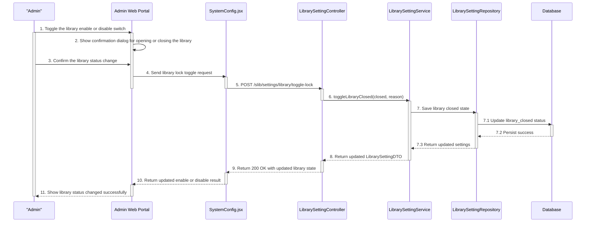

# FE-39 Enable/Disable Library

```mermaid
sequenceDiagram
    participant Users as "Admin"
    participant Client as Admin Web Portal
    participant ConfigPage as SystemConfig.jsx
    participant SettingController as LibrarySettingController
    participant SettingService as LibrarySettingService
    participant SettingRepo as LibrarySettingRepository
    participant DB as Database

    Users->>Client: 1. Toggle the library enable or disable switch
    activate Users
    activate Client
    Client->>Client: 2. Show confirmation dialog for opening or closing the library
    Users->>Client: 3. Confirm the library status change
    Client->>ConfigPage: 4. Send library lock toggle request
    activate ConfigPage
    ConfigPage->>SettingController: 5. POST /slib/settings/library/toggle-lock
    deactivate ConfigPage
    deactivate Client
    activate SettingController
    SettingController->>SettingService: 6. toggleLibraryClosed(closed, reason)
    deactivate SettingController
    activate SettingService
    SettingService->>SettingRepo: 7. Save library closed state
    activate SettingRepo
    SettingRepo->>DB: 7.1 Update library_closed status
    activate DB
    DB-->>SettingRepo: 7.2 Persist success
    deactivate DB
    SettingRepo-->>SettingService: 7.3 Return updated settings
    deactivate SettingRepo
    SettingService-->>SettingController: 8. Return updated LibrarySettingDTO
    deactivate SettingService
    activate SettingController
    SettingController-->>ConfigPage: 9. Return 200 OK with updated library state
    deactivate SettingController
    activate ConfigPage
    ConfigPage-->>Client: 10. Return updated enable or disable result
    deactivate ConfigPage
    activate Client
    Client-->>Users: 11. Show library status changed successfully
    deactivate Client
    deactivate Users
```
