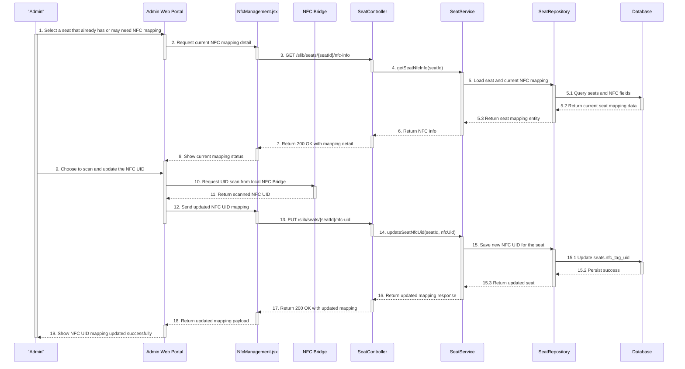

# FE-48a View and Update NFC Tag UID Mapping

```mermaid
sequenceDiagram
    participant Users as "Admin"
    participant Client as Admin Web Portal
    participant NfcPage as NfcManagement.jsx
    participant Bridge as NFC Bridge
    participant SeatController as SeatController
    participant SeatService as SeatService
    participant SeatRepo as SeatRepository
    participant DB as Database

    Users->>Client: 1. Select a seat that already has or may need NFC mapping
    activate Users
    activate Client
    Client->>NfcPage: 2. Request current NFC mapping detail
    activate NfcPage
    NfcPage->>SeatController: 3. GET /slib/seats/{seatId}/nfc-info
    deactivate NfcPage
    deactivate Client
    activate SeatController
    SeatController->>SeatService: 4. getSeatNfcInfo(seatId)
    deactivate SeatController
    activate SeatService
    SeatService->>SeatRepo: 5. Load seat and current NFC mapping
    activate SeatRepo
    SeatRepo->>DB: 5.1 Query seats and NFC fields
    activate DB
    DB-->>SeatRepo: 5.2 Return current seat mapping data
    deactivate DB
    SeatRepo-->>SeatService: 5.3 Return seat mapping entity
    deactivate SeatRepo
    SeatService-->>SeatController: 6. Return NFC info
    deactivate SeatService
    activate SeatController
    SeatController-->>NfcPage: 7. Return 200 OK with mapping detail
    deactivate SeatController
    activate NfcPage
    NfcPage-->>Client: 8. Show current mapping status
    deactivate NfcPage
    activate Client
    Users->>Client: 9. Choose to scan and update the NFC UID
    Client->>Bridge: 10. Request UID scan from local NFC Bridge
    activate Bridge
    Bridge-->>Client: 11. Return scanned NFC UID
    deactivate Bridge
    Client->>NfcPage: 12. Send updated NFC UID mapping
    activate NfcPage
    NfcPage->>SeatController: 13. PUT /slib/seats/{seatId}/nfc-uid
    deactivate NfcPage
    deactivate Client
    activate SeatController
    SeatController->>SeatService: 14. updateSeatNfcUid(seatId, nfcUid)
    deactivate SeatController
    activate SeatService
    SeatService->>SeatRepo: 15. Save new NFC UID for the seat
    activate SeatRepo
    SeatRepo->>DB: 15.1 Update seats.nfc_tag_uid
    activate DB
    DB-->>SeatRepo: 15.2 Persist success
    deactivate DB
    SeatRepo-->>SeatService: 15.3 Return updated seat
    deactivate SeatRepo
    SeatService-->>SeatController: 16. Return updated mapping response
    deactivate SeatService
    activate SeatController
    SeatController-->>NfcPage: 17. Return 200 OK with updated mapping
    deactivate SeatController
    activate NfcPage
    NfcPage-->>Client: 18. Return updated mapping payload
    deactivate NfcPage
    activate Client
    Client-->>Users: 19. Show NFC UID mapping updated successfully
    deactivate Client
    deactivate Users
```
