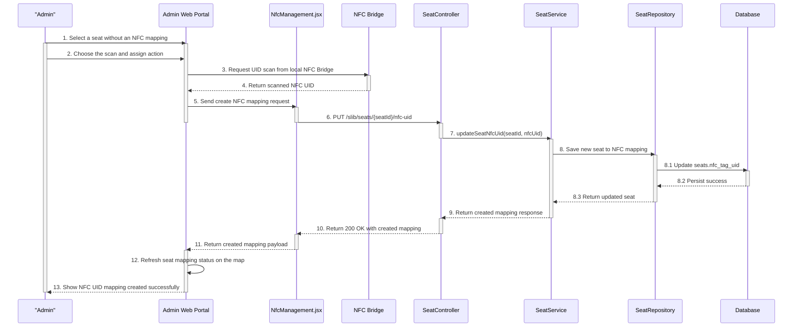

# FE-48b Create NFC Tag UID Mapping

```mermaid
sequenceDiagram
    participant Users as "Admin"
    participant Client as Admin Web Portal
    participant NfcPage as NfcManagement.jsx
    participant Bridge as NFC Bridge
    participant SeatController as SeatController
    participant SeatService as SeatService
    participant SeatRepo as SeatRepository
    participant DB as Database

    Users->>Client: 1. Select a seat without an NFC mapping
    activate Users
    activate Client
    Users->>Client: 2. Choose the scan and assign action
    Client->>Bridge: 3. Request UID scan from local NFC Bridge
    activate Bridge
    Bridge-->>Client: 4. Return scanned NFC UID
    deactivate Bridge
    Client->>NfcPage: 5. Send create NFC mapping request
    activate NfcPage
    NfcPage->>SeatController: 6. PUT /slib/seats/{seatId}/nfc-uid
    deactivate NfcPage
    deactivate Client
    activate SeatController
    SeatController->>SeatService: 7. updateSeatNfcUid(seatId, nfcUid)
    deactivate SeatController
    activate SeatService
    SeatService->>SeatRepo: 8. Save new seat to NFC mapping
    activate SeatRepo
    SeatRepo->>DB: 8.1 Update seats.nfc_tag_uid
    activate DB
    DB-->>SeatRepo: 8.2 Persist success
    deactivate DB
    SeatRepo-->>SeatService: 8.3 Return updated seat
    deactivate SeatRepo
    SeatService-->>SeatController: 9. Return created mapping response
    deactivate SeatService
    activate SeatController
    SeatController-->>NfcPage: 10. Return 200 OK with created mapping
    deactivate SeatController
    activate NfcPage
    NfcPage-->>Client: 11. Return created mapping payload
    deactivate NfcPage
    activate Client
    Client->>Client: 12. Refresh seat mapping status on the map
    Client-->>Users: 13. Show NFC UID mapping created successfully
    deactivate Client
    deactivate Users
```
