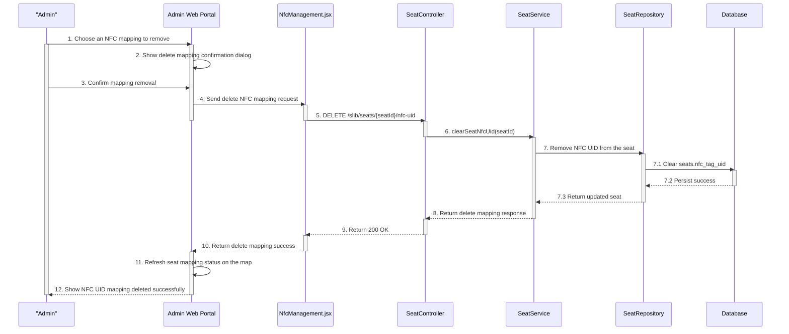

# FE-48c Delete NFC Tag UID Mapping

```mermaid
sequenceDiagram
    participant Users as "Admin"
    participant Client as Admin Web Portal
    participant NfcPage as NfcManagement.jsx
    participant SeatController as SeatController
    participant SeatService as SeatService
    participant SeatRepo as SeatRepository
    participant DB as Database

    Users->>Client: 1. Choose an NFC mapping to remove
    activate Users
    activate Client
    Client->>Client: 2. Show delete mapping confirmation dialog
    Users->>Client: 3. Confirm mapping removal
    Client->>NfcPage: 4. Send delete NFC mapping request
    activate NfcPage
    NfcPage->>SeatController: 5. DELETE /slib/seats/{seatId}/nfc-uid
    deactivate NfcPage
    deactivate Client
    activate SeatController
    SeatController->>SeatService: 6. clearSeatNfcUid(seatId)
    deactivate SeatController
    activate SeatService
    SeatService->>SeatRepo: 7. Remove NFC UID from the seat
    activate SeatRepo
    SeatRepo->>DB: 7.1 Clear seats.nfc_tag_uid
    activate DB
    DB-->>SeatRepo: 7.2 Persist success
    deactivate DB
    SeatRepo-->>SeatService: 7.3 Return updated seat
    deactivate SeatRepo
    SeatService-->>SeatController: 8. Return delete mapping response
    deactivate SeatService
    activate SeatController
    SeatController-->>NfcPage: 9. Return 200 OK
    deactivate SeatController
    activate NfcPage
    NfcPage-->>Client: 10. Return delete mapping success
    deactivate NfcPage
    activate Client
    Client->>Client: 11. Refresh seat mapping status on the map
    Client-->>Users: 12. Show NFC UID mapping deleted successfully
    deactivate Client
    deactivate Users
```
