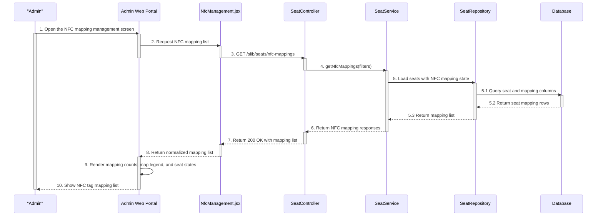

# FE-49 View NFC Tag Mapping List

```mermaid
sequenceDiagram
    participant Users as "Admin"
    participant Client as Admin Web Portal
    participant NfcPage as NfcManagement.jsx
    participant SeatController as SeatController
    participant SeatService as SeatService
    participant SeatRepo as SeatRepository
    participant DB as Database

    Users->>Client: 1. Open the NFC mapping management screen
    activate Users
    activate Client
    Client->>NfcPage: 2. Request NFC mapping list
    activate NfcPage
    NfcPage->>SeatController: 3. GET /slib/seats/nfc-mappings
    deactivate NfcPage
    deactivate Client
    activate SeatController
    SeatController->>SeatService: 4. getNfcMappings(filters)
    deactivate SeatController
    activate SeatService
    SeatService->>SeatRepo: 5. Load seats with NFC mapping state
    activate SeatRepo
    SeatRepo->>DB: 5.1 Query seat and mapping columns
    activate DB
    DB-->>SeatRepo: 5.2 Return seat mapping rows
    deactivate DB
    SeatRepo-->>SeatService: 5.3 Return mapping list
    deactivate SeatRepo
    SeatService-->>SeatController: 6. Return NFC mapping responses
    deactivate SeatService
    activate SeatController
    SeatController-->>NfcPage: 7. Return 200 OK with mapping list
    deactivate SeatController
    activate NfcPage
    NfcPage-->>Client: 8. Return normalized mapping list
    deactivate NfcPage
    activate Client
    Client->>Client: 9. Render mapping counts, map legend, and seat states
    Client-->>Users: 10. Show NFC tag mapping list
    deactivate Client
    deactivate Users
```
