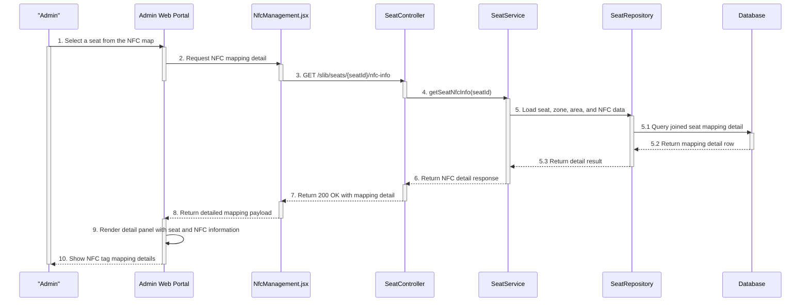

# FE-50 View NFC Tag Mapping Details

```mermaid
sequenceDiagram
    participant Users as "Admin"
    participant Client as Admin Web Portal
    participant NfcPage as NfcManagement.jsx
    participant SeatController as SeatController
    participant SeatService as SeatService
    participant SeatRepo as SeatRepository
    participant DB as Database

    Users->>Client: 1. Select a seat from the NFC map
    activate Users
    activate Client
    Client->>NfcPage: 2. Request NFC mapping detail
    activate NfcPage
    NfcPage->>SeatController: 3. GET /slib/seats/{seatId}/nfc-info
    deactivate NfcPage
    deactivate Client
    activate SeatController
    SeatController->>SeatService: 4. getSeatNfcInfo(seatId)
    deactivate SeatController
    activate SeatService
    SeatService->>SeatRepo: 5. Load seat, zone, area, and NFC data
    activate SeatRepo
    SeatRepo->>DB: 5.1 Query joined seat mapping detail
    activate DB
    DB-->>SeatRepo: 5.2 Return mapping detail row
    deactivate DB
    SeatRepo-->>SeatService: 5.3 Return detail result
    deactivate SeatRepo
    SeatService-->>SeatController: 6. Return NFC detail response
    deactivate SeatService
    activate SeatController
    SeatController-->>NfcPage: 7. Return 200 OK with mapping detail
    deactivate SeatController
    activate NfcPage
    NfcPage-->>Client: 8. Return detailed mapping payload
    deactivate NfcPage
    activate Client
    Client->>Client: 9. Render detail panel with seat and NFC information
    Client-->>Users: 10. Show NFC tag mapping details
    deactivate Client
    deactivate Users
```
