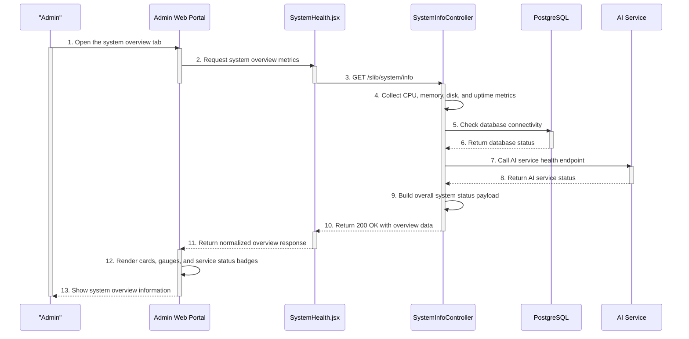

# FE-56 View System Overview Information

```mermaid
sequenceDiagram
    participant Users as "Admin"
    participant Client as Admin Web Portal
    participant HealthPage as SystemHealth.jsx
    participant InfoController as SystemInfoController
    participant DB as PostgreSQL
    participant AiService as AI Service

    Users->>Client: 1. Open the system overview tab
    activate Users
    activate Client
    Client->>HealthPage: 2. Request system overview metrics
    activate HealthPage
    HealthPage->>InfoController: 3. GET /slib/system/info
    deactivate HealthPage
    deactivate Client
    activate InfoController
    InfoController->>InfoController: 4. Collect CPU, memory, disk, and uptime metrics
    InfoController->>DB: 5. Check database connectivity
    activate DB
    DB-->>InfoController: 6. Return database status
    deactivate DB
    InfoController->>AiService: 7. Call AI service health endpoint
    activate AiService
    AiService-->>InfoController: 8. Return AI service status
    deactivate AiService
    InfoController->>InfoController: 9. Build overall system status payload
    InfoController-->>HealthPage: 10. Return 200 OK with overview data
    deactivate InfoController
    activate HealthPage
    HealthPage-->>Client: 11. Return normalized overview response
    deactivate HealthPage
    activate Client
    Client->>Client: 12. Render cards, gauges, and service status badges
    Client-->>Users: 13. Show system overview information
    deactivate Client
    deactivate Users
```
