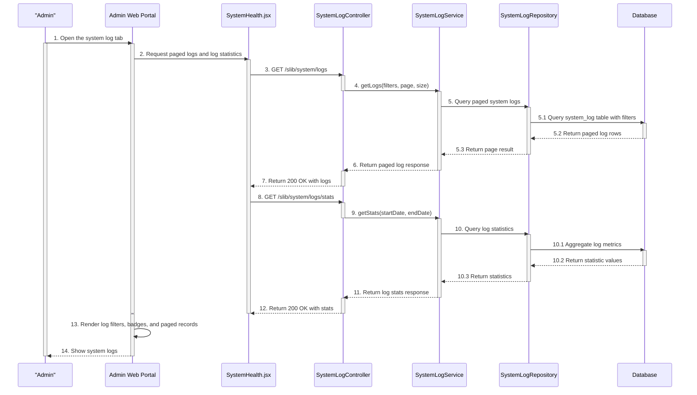

# FE-57 View System Log

```mermaid
sequenceDiagram
    participant Users as "Admin"
    participant Client as Admin Web Portal
    participant HealthPage as SystemHealth.jsx
    participant LogController as SystemLogController
    participant LogService as SystemLogService
    participant LogRepo as SystemLogRepository
    participant DB as Database

    Users->>Client: 1. Open the system log tab
    activate Users
    activate Client
    Client->>HealthPage: 2. Request paged logs and log statistics
    activate HealthPage
    HealthPage->>LogController: 3. GET /slib/system/logs
    activate LogController
    LogController->>LogService: 4. getLogs(filters, page, size)
    deactivate LogController
    activate LogService
    LogService->>LogRepo: 5. Query paged system logs
    activate LogRepo
    LogRepo->>DB: 5.1 Query system_log table with filters
    activate DB
    DB-->>LogRepo: 5.2 Return paged log rows
    deactivate DB
    LogRepo-->>LogService: 5.3 Return page result
    deactivate LogRepo
    LogService-->>LogController: 6. Return paged log response
    deactivate LogService
    activate LogController
    LogController-->>HealthPage: 7. Return 200 OK with logs
    deactivate LogController

    HealthPage->>LogController: 8. GET /slib/system/logs/stats
    activate LogController
    LogController->>LogService: 9. getStats(startDate, endDate)
    deactivate LogController
    activate LogService
    LogService->>LogRepo: 10. Query log statistics
    activate LogRepo
    LogRepo->>DB: 10.1 Aggregate log metrics
    activate DB
    DB-->>LogRepo: 10.2 Return statistic values
    deactivate DB
    LogRepo-->>LogService: 10.3 Return statistics
    deactivate LogRepo
    LogService-->>LogController: 11. Return log stats response
    deactivate LogService
    activate LogController
    LogController-->>HealthPage: 12. Return 200 OK with stats
    deactivate LogController
    deactivate HealthPage
    deactivate Client
    activate Client
    Client->>Client: 13. Render log filters, badges, and paged records
    Client-->>Users: 14. Show system logs
    deactivate Client
    deactivate Users
```
