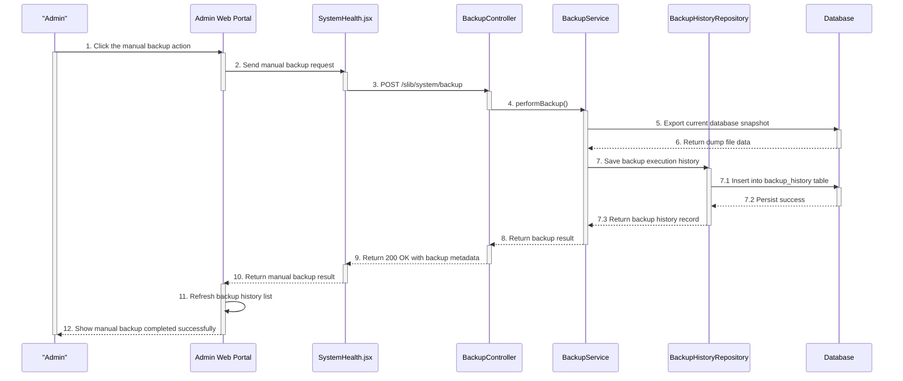

# FE-58 Backup Data Manually

```mermaid
sequenceDiagram
    participant Users as "Admin"
    participant Client as Admin Web Portal
    participant HealthPage as SystemHealth.jsx
    participant BackupController as BackupController
    participant BackupService as BackupService
    participant HistoryRepo as BackupHistoryRepository
    participant DB as Database

    Users->>Client: 1. Click the manual backup action
    activate Users
    activate Client
    Client->>HealthPage: 2. Send manual backup request
    activate HealthPage
    HealthPage->>BackupController: 3. POST /slib/system/backup
    deactivate HealthPage
    deactivate Client
    activate BackupController
    BackupController->>BackupService: 4. performBackup()
    deactivate BackupController
    activate BackupService
    BackupService->>DB: 5. Export current database snapshot
    activate DB
    DB-->>BackupService: 6. Return dump file data
    deactivate DB
    BackupService->>HistoryRepo: 7. Save backup execution history
    activate HistoryRepo
    HistoryRepo->>DB: 7.1 Insert into backup_history table
    activate DB
    DB-->>HistoryRepo: 7.2 Persist success
    deactivate DB
    HistoryRepo-->>BackupService: 7.3 Return backup history record
    deactivate HistoryRepo
    BackupService-->>BackupController: 8. Return backup result
    deactivate BackupService
    activate BackupController
    BackupController-->>HealthPage: 9. Return 200 OK with backup metadata
    deactivate BackupController
    activate HealthPage
    HealthPage-->>Client: 10. Return manual backup result
    deactivate HealthPage
    activate Client
    Client->>Client: 11. Refresh backup history list
    Client-->>Users: 12. Show manual backup completed successfully
    deactivate Client
    deactivate Users
```
